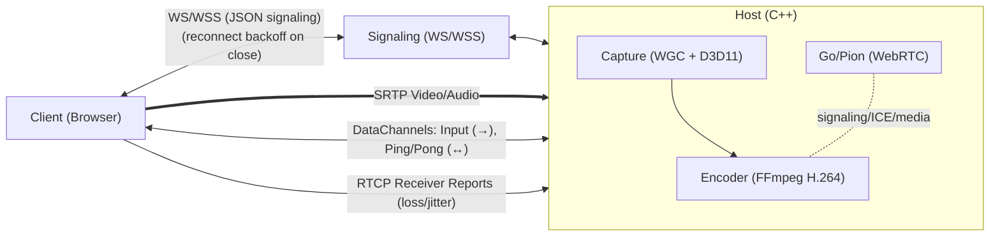
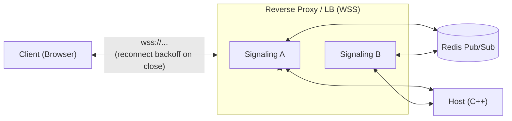

# P2P Cloud Gaming & Remote Desktop

This project is a high-performance, peer-to-peer (P2P) solution for cloud gaming and remote desktop streaming. It allows a user to stream gameplay or a desktop session from a powerful "Host" machine to a lightweight "Client" machine with low latency, using a custom-built architecture that leverages WebRTC for direct P2P communication.

## Architecture Overview

The system is composed of three main components that work together to establish a streaming session:



Optional scalable signaling topology:



1.  **Host (C++)**: A native Windows application that captures the screen (Windows Graphics Capture), audio (WASAPI), and encodes them into a video stream. It also receives and simulates keyboard/mouse input from the client.
2.  **Signaling Server (Node.js)**: A production-ready, scalable signaling server (`ScalableSignalingServer.js`) with Redis Pub/Sub, comprehensive security, observability, and resilience features. Supports single-node or horizontal scaling with stateless design.
3.  **Client (HTML/JS)**: A web-based application that connects to the Host, receives the video/audio stream, and sends user input back.

---

## Core Technologies

| Module | Language(s) | Key Libraries & Frameworks | Purpose |
| :--- | :--- | :--- | :--- |
| **Host** | C++ | **FFmpeg** (H.264), **Pion WebRTC** (Go), **WinRT/C++ (WGC)**, **Direct3D 11** | Screen/audio capture, H.264 encoding, WebRTC session management. |
| **Server** | JavaScript | **Node.js**, **ws** (WebSocket), **Redis**, **pino** (logging), **zod** (validation), **prom-client** (metrics) | Production signaling with security, observability, and scalability. |
| **Client** | JavaScript | **HTML5**, WebRTC API | Renders video, captures user input, and manages the WebRTC connection. |

---

## Module Breakdown

### 1. Host (`/Host`)

The Host is the core of the streaming solution. It runs on the machine with the game or application to be streamed.

**Key Components:**
*   **`main.cpp`**: Entry point. Initializes D3D11, WGC capture, audio, encoder, and signaling. Loads `config.json`.
*   **Capture (`CaptureHelpers.cpp`)**: Uses **Windows Graphics Capture (WGC)** with a free-threaded frame pool. Frames are copied into a fixed **texture pool** (ID3D11Texture2D) to avoid per-frame allocations.
*   **Encoding (`Encoder.cpp`)**: Encodes frames with FFmpeg H.264 using the best available hardware (NVENC/QSV/AMF) and **GPU VideoProcessor** for BGRA→NV12. Caches **ID3D11VideoProcessorInput/OutputView** objects to avoid per-frame D3D allocations. Adaptive bitrate control is handled here.
*   **Audio (`AudioCapturer.cpp`)**: Uses **WASAPI** **event-driven** capture (with fallback) and **IAudioClock** for precise timestamps. Reuses persistent float buffers to minimize heap churn. Opus encoding and send to WebRTC.
*   **WebRTC (`gortc_main/main.go`)**: Pion-based module (Go, C-shared) for PeerConnection, data channels, and ICE. Provides RTT via video ping/pong and intercepts RTCP Receiver Reports.
*   **Input Handling (`KeyInputHandler`, `MouseInputHandler`)**: Receives events via data channels and simulates locally using `SendInput`.
*   **Signaling (`Websocket.cpp`)**: Connects to the Node server; validates inbound input messages, enforces rate limits, and sends/receives SDP/ICE.

### 2. Signaling Server (`/Server`)

A production-ready, horizontally-scalable signaling server with comprehensive security, observability, and resilience features.

**Key Components:**
*   **`ScalableSignalingServer.js`**: The main production server with Redis Pub/Sub, comprehensive security, and observability.
*   **`config.js`**: Environment-driven configuration with schema validation using `zod`.
*   **`logger.js`**: Structured JSON logging with `pino`, including redaction and contextual fields.
*   **`health.js`**: Lightweight HTTP server exposing `/healthz`, `/readyz`, and `/metrics` endpoints.
*   **`validation.js`**: Message schema validation using `zod` for offer/answer/candidate/control messages.
*   **`rateLimiter.js`**: Redis-backed token bucket rate limiting for connections and messages.
*   **`redisScripts.js`**: Lua scripts for atomic room join/leave operations.
*   **`metrics.js`**: Prometheus metrics for observability (connections, messages, latency, errors).

**Production Features:**
*   **Security**: WSS enforcement, Origin validation, JWT authentication, room authorization
*   **Resilience**: Graceful shutdown, Redis circuit breaker, atomic operations, backpressure handling
*   **Observability**: Structured logging, Prometheus metrics, health checks, distributed tracing
*   **Scalability**: Stateless design, Redis Pub/Sub, horizontal scaling support
*   **Rate Limiting**: Per-connection, per-IP, and per-room message throttling
*   **Input Validation**: Schema-based message validation with error metrics

**Legacy Components:**
*   **`PureSignalingServer.js`**: Simple implementation for development/testing.
*   **`SecureSignalingServer.js`**: Room-based signaling with basic session management.

### 3. Client (`/Client`)

The Client is a simple web page that allows a user to connect to a Host and start streaming.

**Key Components:**
*   **`index.html`**: The main HTML structure, including a video element to render the stream.
*   **`PeerClient.js`**: Contains all the client-side logic for:
    *   Connecting to the Signaling Server.
    *   Creating a `RTCPeerConnection`.
    *   Creating an "offer" to send to the Host.
    *   Processing the "answer" from the Host.
    *   Handling ICE candidates to find the best P2P path.
    *   Receiving the remote video track and attaching it to the `<video>` element.
    *   Capturing keyboard/mouse events and sending them over a `RTCDataChannel`.

---

## How It Works: The Connection Flow

1.  The **Host** application is started. It connects to the **Signaling Server** via WebSocket and waits in a "room".
2.  The user opens the **Client** web page and enters the same room ID. The Client also connects to the Signaling Server.
3.  The Signaling Server now knows about both peers in the room and can relay messages between them.
4.  The **Client** creates a WebRTC "offer" (a description of its desired media session) and sends it to the server.
5.  The **Server** forwards this offer to the **Host**.
6.  The **Host** receives the offer, creates an "answer," and sends it back to the **Client** via the server.
7.  Simultaneously, both Client and Host are gathering **ICE candidates** (potential IP addresses and ports) and exchanging them through the server.
8.  Once they have exchanged the offer/answer and enough ICE candidates, a direct **P2P connection** is established between the Client and Host.
9.  The **Host** begins capturing (WGC), encoding (H.264), and streaming video frames directly to the **Client**.
10. The **Client** begins receiving the video stream and sending user input back to the Host. The Signaling Server is no longer needed for this session.

## Peer Disconnection Handling

The system now properly handles peer disconnection. When a client closes their browser or the connection is otherwise interrupted, the following occurs:

1.  The **Signaling Server** detects the closed WebSocket connection.
2.  It sends a `peer-disconnected` message to the other peer in the room (the **Host**).
3.  The **Host** receives this message and initiates a graceful shutdown, closing the PeerConnection, stopping the capture and encoding threads, and releasing all resources.
4.  On the **Client** side, if the connection is lost, it will display a "Connection Lost" message and attempt to reconnect. If the host disconnects, the client will be notified and will not attempt to reconnect.

---

## Adaptive Streaming & Bitrate Control

To provide a smooth experience even under changing network conditions, the Host implements a dynamic bitrate system that adapts the video quality in real-time. This prevents stream stuttering and freezing on weaker or unstable networks.

### Technical Implementation: The Feedback Loop

The system works by creating a continuous feedback loop between the Client and the Host.

1.  **Client Sends Feedback (RTCP):**
    *   The user's web browser, while receiving the video, automatically sends **RTCP (RTP Control Protocol) Receiver Reports** back to the Host. This is a standard part of the WebRTC protocol.
    *   These reports contain crucial statistics, most importantly **Packet Loss** (the percentage of video packets that never arrived) and **Jitter** (the variation in packet arrival times).

2.  **Go/Pion Intercepts the Feedback:**
    *   In `gortc_main/main.go`, an **RTCP Interceptor** (`rtcpReaderInterceptor`) is registered with the Pion WebRTC stack.
    *   This interceptor's job is to "catch" these incoming RTCP reports, open them, and extract the packet loss and jitter values.

3.  **Go Calls the C++ Callback:**
    *   The Go interceptor then calls a C function pointer that was registered by the C++ application.
    *   This call crosses the language boundary from Go to C++, passing the network statistics as arguments.

4.  **Encoder-managed AIMD controller:**
    *   RTCP stats (loss/jitter) are forwarded into `Encoder::OnRtcpFeedback`. RTT is computed from video datachannel ping/pong and combined in the callback.
    *   An **AIMD** (Additive Increase / Multiplicative Decrease) controller adjusts bitrate within configured min/max bounds.
    *   If runtime bitrate changes aren't supported by the current codec, the encoder schedules a safe reopen between frames.

This entire process runs continuously, allowing the stream to adapt to changing network conditions in near real-time, ensuring the best possible quality and smoothness.

---

## Advanced Input Handling Systems

The project features several sophisticated input handling systems designed for production-grade remote desktop and gaming applications:

### 1. Input Statistics & Observability System

A comprehensive telemetry system that tracks all input events, success rates, and system performance with 1 Hz periodic logging.

#### Features:
- **Complete Event Tracking**: Monitors all keyboard and mouse events from reception to injection
- **Success Rate Metrics**: Calculates injection success rates and identifies problematic patterns
- **Performance Monitoring**: Tracks processing times and system efficiency
- **Periodic Reporting**: 1 Hz console output with formatted statistics

#### Tracked Metrics:
- **Keyboard**: Events received/injected/dropped/skipped, timeout recoveries, emergency releases
- **Mouse**: Events received/injected/skipped, coordinate transformations, click processing
- **System Health**: Processing times, uptime, success rates, and throughput

#### Example Output:
```
[InputStats] Uptime: 120s | KB: 1250 in, 1180 inj, 45 drop, 25 skip, 5 mod_timeout,
0 reg_timeout, 2 stale, 5 recovered, 1 emergency | Mouse: 3200 in, 3100 inj,
100 skip, 45 coal, 380 click, 25 wheel | Rates: KB 94.4% inj, 3.6% drop,
2.0% skip | Mouse 96.9% inj, 3.1% skip, 1.4% coal | Avg Process: 45us
```

### 2. FSM State Management & Recovery

A Finite State Machine (FSM) system that manages keyboard state transitions and provides automatic recovery from stuck keys.

#### Key Features:
- **State Validation**: Prevents invalid transitions (e.g., down→down, up→up)
- **Stuck Key Detection**: Monitors for keys held longer than configurable timeouts
- **Automatic Recovery**: Injects key-up events to release stuck modifiers
- **Modifier-Aware Timeouts**: Different timeouts for modifier keys vs regular keys

#### FSM States:
- **UP**: Key is released
- **DOWN**: Key is pressed
- **STUCK_RECOVERY**: Key is being recovered from stuck state

#### Configuration:
```cpp
// Modifier keys (Ctrl, Shift, Alt, Win) - 5 seconds
std::chrono::milliseconds modifierKeyTimeout = 5000ms;

// Regular keys - disabled by default (30 seconds if enabled)
std::chrono::milliseconds regularKeyTimeout = 30000ms;
bool enableRegularKeyTimeout = false;
```

#### Benefits:
- **Eliminates Stuck Keys**: Automatic detection and recovery prevents common gaming issues
- **Gaming-Friendly**: Configurable timeouts respect legitimate long key holds
- **State Consistency**: Ensures keyboard state remains synchronized between client and host

### 3. DPI-Aware Mouse Coordinate Transformation

An advanced coordinate transformation system that accurately maps client mouse coordinates to host window positions, accounting for DPI scaling and capture transformations.

#### Key Capabilities:
- **DPI Scaling Support**: Uses `GetDpiForMonitor` for accurate scaling on high-DPI displays
- **Target Window Mapping**: Transforms client coordinates to specific target window client area
- **Scaling Compensation**: Accounts for capture scaling differences between client view and host window
- **Virtual Desktop Support**: Handles multi-monitor and virtual desktop spanning
- **Optional Clipping**: Prevents input from affecting windows outside the streamed area

#### Coordinate Transformation Flow:
1. **Client Coordinates** → Client view (e.g., 1920x1080)
2. **Scaling Adjustment** → Account for capture scaling factors
3. **DPI Transformation** → Apply monitor DPI scaling
4. **Window Mapping** → Transform to target window client coordinates
5. **Virtual Desktop** → Convert to absolute mouse coordinates (0-65535)
6. **Optional Clipping** → Constrain to target window bounds

#### Configuration:
```cpp
MouseCoordinateTransform::TransformConfig config;
config.enableClipping = true;      // Clip to target window bounds
config.enableClipCursor = false;   // Use ClipCursor API during streaming
config.accountForScaling = true;   // Account for capture scaling
config.captureScaleX = 1.25;      // Horizontal scaling factor
config.captureScaleY = 1.0;       // Vertical scaling factor
```

### 4. Input Injection Preconditions

Safety and security checks performed before injecting any input events to prevent system instability and ensure proper focus management.

#### Precondition Checks:
- **Window Validity**: Ensures target window exists and is accessible
- **Foreground Focus**: Verifies target window has foreground focus (configurable)
- **Window State**: Checks if window is visible and enabled
- **Input Timing**: Validates event timing and prevents rapid-fire injection
- **Resource Limits**: Monitors system resources and prevents overload

#### Configuration Options:
```cpp
InputInjection::InjectionPolicy policy;
policy.requireForeground = true;    // Require target window foreground
policy.requireVisible = true;      // Require target window visible
policy.requireEnabled = true;      // Require target window enabled
policy.autoFocusOnSkip = false;     // Attempt to focus window if skipped
```

#### Security Benefits:
- **Input Containment**: Prevents input from affecting unintended applications
- **Focus Protection**: Ensures input only reaches the intended target window
- **System Stability**: Prevents injection into invalid or unresponsive windows
- **Resource Protection**: Monitors injection rates to prevent system overload

### 5. Windows Key Blocking

Complete blocking of Windows key events to prevent accidental system menu activation during remote desktop sessions.

#### Blocked Keys:
- **Left Windows Key**: `MetaLeft`, `OSLeft`, `Super_L`
- **Right Windows Key**: `MetaRight`, `OSRight`, `Super_R`
- **Generic Windows**: `Meta`, `OS`, `Super`

#### Implementation:
- **Early Filtering**: Windows key events are blocked before any processing
- **Complete Blocking**: Both keydown and keyup events are blocked
- **Metrics Tracking**: Blocked events are tracked in statistics
- **Clear Logging**: Blocked events are logged with clear identification

#### Example Output:
```
[KeyInput] BLOCKED DOWN  code=MetaLeft (Windows key blocked)
[KeyInput] BLOCKED UP    code=MetaLeft (Windows key blocked)
```

#### Statistics Integration:
```
[InputStats] KB: 1250 in, 1180 inj, 45 drop, 25 skip, 8 blocked, ...
```

#### Benefits:
- **Gaming Safety**: Prevents accidental Windows menu activation during gameplay
- **Session Continuity**: Avoids disrupting remote desktop sessions
- **System Stability**: Prevents Windows key from interfering with captured applications
- **Observability**: Tracks how many Windows key events are being blocked

### 6. Sequence IDs and Desynchronization Recovery

Advanced sequence management system that detects and recovers from message ordering issues and desynchronization between client and host.

#### Key Features:
- **Monotonic Sequence IDs**: Each input message includes a monotonically increasing sequence number
- **Gap Detection**: Automatically detects missing or out-of-order messages
- **Smart Recovery**: Multiple recovery strategies based on gap severity
- **State Synchronization**: Snapshot-based full state recovery for severe desync
- **Recovery Throttling**: Prevents excessive recovery operations

#### Sequence Processing Flow:
1. **Message Reception** → Extract sequence ID from input message
2. **Gap Analysis** → Compare with expected sequence number
3. **Recovery Decision** → Choose appropriate recovery action based on gap size
4. **Recovery Execution** → Apply recovery (modifier release, snapshot request, or reset)
5. **State Synchronization** → Ensure client and host states are consistent

#### Recovery Strategies:
- **Small Gaps (< 10 messages)**: Release modifier keys to clear stuck state
- **Large Gaps (≥ 10 messages)**: Request full state snapshot from client
- **Severe Desync**: Complete state reset with full key release

#### Configuration:
```cpp
InputSequenceManager::SequenceConfig config;
config.maxGapBeforeRecovery = 10;     // Gap size triggering recovery
config.recoveryThrottleMs = 1000;     // Min time between recoveries
config.enableGapRecovery = true;      // Enable gap-based recovery
config.enableSnapshotRecovery = true; // Enable snapshot recovery
```

#### Statistics Integration:
```
[InputStats] Seq: 5 gaps, 3 recoveries, 2 snap_req, 2 snap_recv
```

#### Benefits:
- **Reliability**: Handles network packet loss and reordering gracefully
- **Deterministic Recovery**: Users don't notice state recovery operations
- **Performance**: Minimal overhead with intelligent gap detection
- **Monitoring**: Complete visibility into sequence health and recovery operations

### 7. Hot Path Logging Optimization

Performance-optimized logging system designed to minimize overhead during high-frequency input events.

#### Key Features:
- **Conditional Per-Event Logging**: Only logs individual events when explicitly enabled for debugging
- **Aggregated Statistics**: 10Hz aggregated stats by default instead of per-event logging
- **Mouse Move Coalescing**: Combines rapid mouse movements to reduce processing overhead
- **Configurable Intervals**: Adjustable logging frequency based on use case requirements

#### Logging Configuration:
```cpp
InputStats::LoggingConfig config;
config.enablePerEventLogging = false;      // Default: disabled for performance
config.enableAggregatedLogging = true;     // Default: 10Hz aggregated stats
config.enableMouseMoveCoalescing = true;   // Default: coalesce mouse moves
config.aggregatedLogIntervalMs = 100;      // Default: 100ms (10Hz)
```

#### Mouse Move Coalescing:
- **Smart Combination**: Rapid mouse movements are combined into single events
- **Latest Position Priority**: Only the most recent mouse position is processed
- **Performance Boost**: Reduces processing overhead during mouse dragging/high-frequency movement
- **Metric Tracking**: Coalesced events are tracked separately for observability

#### Performance Benefits:
- **Reduced CPU Usage**: Eliminates console I/O overhead during high-frequency events
- **Lower Latency**: Mouse move coalescing prevents input queue buildup
- **Better Responsiveness**: Aggregated logging prevents logging thread from becoming bottleneck
- **Configurable Trade-offs**: Can enable detailed logging for debugging when needed

#### Statistics Integration:
```
[InputStats] Mouse: 1250 in, 1200 inj, 25 skip, 45 coal, ...
```

Where `coal` represents the number of mouse moves that were coalesced.

#### Configuration API:
```cpp
// Enable/disable detailed per-event logging
InputStats::enablePerEventLogging(true);  // For debugging only

// Adjust aggregated logging frequency
InputStats::setAggregatedLogInterval(50); // 20Hz for more frequent stats

// Control mouse move coalescing
InputStats::enableMouseMoveCoalescing(true);
```

#### Use Cases:
- **Gaming**: Mouse move coalescing prevents performance degradation during rapid aiming
- **Remote Desktop**: Reduces logging overhead during normal usage, enables detailed logging for troubleshooting
- **Development**: Detailed logging can be enabled for debugging input issues without performance impact
- **Production**: Aggregated logging provides monitoring without performance penalty

### Integration Benefits

These systems work together to provide enterprise-grade input handling:

#### Reliability Stack:
1. **Sequence Management** provides desynchronization recovery
2. **Statistics** provide observability into system health
3. **FSM** ensures state consistency and prevents stuck keys
4. **Coordinate Transform** delivers pixel-perfect mouse positioning
5. **Preconditions** ensure safe and secure input injection
6. **Windows Key Blocking** prevents system interference

#### Performance Characteristics:
- **Low Latency**: All systems add minimal processing overhead
- **Thread-Safe**: Designed for concurrent access patterns
- **Configurable**: Tunable parameters for different use cases
- **Observable**: Comprehensive metrics for monitoring and debugging

#### Use Cases:
- **Gaming**: Handles network jitter and packet loss during intense gameplay
- **Remote Desktop**: Ensures reliable input even on unstable connections
- **Corporate Networks**: Maintains input integrity across enterprise networks
- **Development**: Provides detailed diagnostics for input system debugging

---

## Input Configuration Reference

This section provides a comprehensive reference for all input-related configuration options available in the system.

### 1. Logging Configuration

Controls logging behavior to optimize performance during high-frequency input events.

```cpp
#include "InputStats.h"

// Create logging configuration
InputStats::LoggingConfig loggingConfig;
loggingConfig.enablePerEventLogging = false;      // Enable detailed per-event logging (default: false)
loggingConfig.enableAggregatedLogging = true;     // Enable 10Hz aggregated stats (default: true)
loggingConfig.enableMouseMoveCoalescing = true;   // Coalesce rapid mouse moves (default: true)
loggingConfig.aggregatedLogIntervalMs = 100;      // Logging interval in ms (default: 100ms = 10Hz)
loggingConfig.maxMouseMovesPerFrame = 1;          // Max mouse moves to process per frame (default: 1)

// Apply configuration
InputStats::updateLoggingConfig(loggingConfig);

// Or use individual setters
InputStats::enablePerEventLogging(false);         // For debugging only - impacts performance
InputStats::enableAggregatedLogging(true);        // Recommended for production monitoring
InputStats::enableMouseMoveCoalescing(true);      // Reduces processing during rapid mouse movement
InputStats::setAggregatedLogInterval(100);        // 10Hz - balance between monitoring and performance
```

#### Logging Configuration Options:
- **enablePerEventLogging**: When `true`, logs every individual input event (high performance impact)
- **enableAggregatedLogging**: When `true`, logs aggregated statistics at configured interval
- **enableMouseMoveCoalescing**: When `true`, combines rapid mouse movements into single events
- **aggregatedLogIntervalMs**: How often to log aggregated stats (100ms = 10Hz, 1000ms = 1Hz)
- **maxMouseMovesPerFrame**: Limits mouse processing to prevent queue buildup

### 2. Sequence Management Configuration

Handles desynchronization recovery for reliable input delivery over unreliable networks.

```cpp
#include "InputSequenceManager.h"

// Create sequence configuration
InputSequenceManager::SequenceConfig seqConfig;
seqConfig.maxGapBeforeRecovery = 10;              // Max gap before triggering recovery (default: 10)
seqConfig.recoveryThrottleMs = 1000;              // Min time between recoveries (default: 1000ms)
seqConfig.enableGapRecovery = true;               // Enable gap-based recovery (default: true)
seqConfig.enableSnapshotRecovery = true;          // Enable snapshot recovery (default: true)
seqConfig.snapshotRequestTimeoutMs = 5000;        // Timeout for snapshot requests (default: 5000ms)

// Apply configuration
InputSequenceManager::updateGlobalConfig(seqConfig);
```

#### Sequence Configuration Options:
- **maxGapBeforeRecovery**: Sequence gap size that triggers recovery (smaller = more sensitive)
- **recoveryThrottleMs**: Minimum time between recovery operations (prevents recovery storms)
- **enableGapRecovery**: Whether to perform recovery on sequence gaps
- **enableSnapshotRecovery**: Whether to request state snapshots for large gaps
- **snapshotRequestTimeoutMs**: How long to wait for snapshot responses

### 3. Input Injection Configuration

Controls input injection behavior and preconditions for secure, reliable input delivery.

```cpp
#include "InputInjection.h"

// Get default policy
auto policy = InputInjection::getDefaultPolicy();
policy.skipOnForegroundCheckFailure = true;        // Skip injection if window not foreground
policy.skipOnWindowStateFailure = true;           // Skip injection if window minimized/invisible
policy.attemptFocusSteal = false;                 // Whether to try bringing window to foreground
policy.focusStealTimeoutMs = 100;                 // Timeout for focus steal attempts

// Apply custom policy
InputInjection::setDefaultPolicy(policy);
```

#### Input Injection Options:
- **skipOnForegroundCheckFailure**: Skip injection if target window is not foreground
- **skipOnWindowStateFailure**: Skip injection if target window is minimized or invisible
- **attemptFocusSteal**: Try to bring target window to foreground if not active
- **focusStealTimeoutMs**: Timeout for focus steal operations

### 4. Input State Machine Configuration

Configures keyboard state management and stuck key recovery.

```cpp
#include "InputStateMachine.h"

// Create FSM configuration
InputStateMachine::FSMConfig fsmConfig;
fsmConfig.modifierKeyTimeout = 2000;               // Timeout for modifier keys (default: 2000ms)
fsmConfig.regularKeyTimeout = 5000;               // Timeout for regular keys (default: 5000ms)
fsmConfig.enableRegularKeyTimeout = false;        // Enable timeout for regular keys (default: false)
fsmConfig.onlyRecoverModifiers = true;            // Only recover stuck modifiers (default: true)

// Create FSM with custom config
InputStateMachine::KeyStateFSM fsm(fsmConfig);
```

#### FSM Configuration Options:
- **modifierKeyTimeout**: How long before declaring modifier keys (Ctrl, Alt, Shift, Win) stuck
- **regularKeyTimeout**: How long before declaring regular keys stuck (if enabled)
- **enableRegularKeyTimeout**: Whether to enable timeout recovery for regular keys
- **onlyRecoverModifiers**: If true, only performs recovery on modifier keys

### 5. Mouse Coordinate Transformation Configuration

Configures mouse coordinate mapping from client to host screen space.

```cpp
#include "MouseCoordinateTransform.h"

// Create transformation configuration
MouseCoordinateTransform::TransformConfig transformConfig;
transformConfig.captureScaleX = 1.0f;              // Horizontal scale factor (default: 1.0)
transformConfig.captureScaleY = 1.0f;              // Vertical scale factor (default: 1.0)
transformConfig.enableDPIScaling = true;           // Enable DPI-aware scaling (default: true)
transformConfig.enableClipping = true;             // Clip to target window bounds (default: true)
transformConfig.virtualDesktopOffsetX = 0;         // Virtual desktop X offset (default: 0)
transformConfig.virtualDesktopOffsetY = 0;         // Virtual desktop Y offset (default: 0)

// Update global configuration
MouseCoordinateTransform::updateGlobalConfig(transformConfig);
```

#### Coordinate Transformation Options:
- **captureScaleX/Y**: Scale factors for captured content (affects mouse positioning)
- **enableDPIScaling**: Whether to apply DPI scaling to coordinates
- **enableClipping**: Whether to clip mouse coordinates to target window bounds
- **virtualDesktopOffsetX/Y**: Offset for virtual desktop positioning

### 6. Windows Key Blocking Configuration

Controls which keys are blocked from injection to prevent system interference.

```cpp
#include "KeyInputHandler.h"

// Windows key blocking is configured via the shouldBlockKey function
// The following keys are blocked by default:
const std::vector<std::string> blockedKeys = {
    "MetaLeft",     // Left Windows key
    "MetaRight"     // Right Windows key
};

// To check if a key should be blocked (used internally):
bool shouldBlock = shouldBlockKey("MetaLeft"); // Returns true

// To modify blocking behavior, you would need to update the
// shouldBlockKey function in KeyInputHandler.cpp
```

#### Windows Key Blocking Options:
- **MetaLeft**: Left Windows key (⊞ Win) - blocked by default
- **MetaRight**: Right Windows key (⊞ Win) - blocked by default
- **Custom Blocking**: Can be extended to block other system keys

### 8. Key Mapping and Extended Keys Configuration

Advanced keyboard mapping with extended key support and keyboard layout awareness.

```cpp
#include "KeyInputHandler.h"

// Test extended key mapping (unit tests)
bool testsPassed = runKeyMappingTests();
// Returns true if all extended key tests pass

// Extended keys that require KEYEVENTF_EXTENDEDKEY flag:
// Right-side modifier keys: VK_RCONTROL, VK_RMENU (AltGr)
// Navigation keys: VK_UP, VK_DOWN, VK_LEFT, VK_RIGHT
// Editing keys: VK_INSERT, VK_DELETE, VK_HOME, VK_END, VK_PRIOR, VK_NEXT
// Numpad: VK_RETURN (numpad enter), VK_DIVIDE
// Function keys: VK_F11, VK_F12 (can be extended)
// Other: VK_NUMLOCK, VK_SCROLL
```

#### Key Mapping Features:
- **Extended Key Detection**: Automatically detects keys requiring `KEYEVENTF_EXTENDEDKEY` flag
- **Layout-Aware Mapping**: Uses target window's keyboard layout instead of foreground layout
- **Comprehensive Testing**: Unit tests verify correct extended key handling
- **Fallback Mechanisms**: Graceful fallback when layout-specific mapping unavailable

#### Extended Key Matrix:

| Key Category | Keys | Extended Flag Required |
|-------------|------|----------------------|
| **Right Modifiers** | Right Ctrl, Right Alt (AltGr) | ✅ Yes |
| **Navigation** | Arrow keys (Up, Down, Left, Right) | ✅ Yes |
| **Editing** | Insert, Delete, Home, End, PgUp, PgDn | ✅ Yes |
| **Numpad** | Numpad Enter, Numpad / | ✅ Yes |
| **Left Modifiers** | Left Ctrl, Left Alt, Shift | ❌ No |
| **Regular Keys** | Letters, Numbers, Space, Tab | ❌ No |
| **Function Keys** | F1-F10 | ❌ No (F11-F12 can be extended) |

#### Keyboard Layout Awareness:
```cpp
// The system automatically:
// 1. Gets target window's thread ID
// 2. Retrieves keyboard layout for that thread
// 3. Maps VK codes to scan codes using correct layout
// 4. Falls back to current layout if target unavailable

// This prevents issues when:
// - Target app uses different keyboard layout than foreground
// - Non-US layouts are active (German, French, etc.)
// - Special characters need correct mapping
```

#### Testing and Validation:
```cpp
// Run comprehensive key mapping tests
extern "C" bool runKeyMappingTests();

// Tests verify:
// - Extended key flag correctness
// - VK to scan code mapping accuracy
// - Keyboard layout awareness
// - Fallback behavior
```

### 9. Safe Memory Management for WebRTC Messages

Advanced RAII wrapper system for preventing memory leaks in WebRTC message handling.

#### RAII Wrapper for C Strings:
```cpp
#include "WebRTCWrapper.h"

// Safe approach - no manual memory management needed
auto mouseMsg = WebRTCWrapper::getMouseChannelMessageSafe();
if (mouseMsg) {
    std::string msg = mouseMsg; // Implicit conversion to string
    processMouseInput(msg);
    // Memory automatically freed when mouseMsg goes out of scope
}

// Old unsafe approach (DO NOT USE):
char* unsafeMsg = getMouseChannelMessage();
if (unsafeMsg) {
    std::string msg(unsafeMsg);
    processMouseInput(msg);
    freeCString(unsafeMsg); // Must remember to call this!
    // Memory leak if exception thrown before freeCString!
}
```

#### Memory Safety Features:
- **Automatic Cleanup**: RAII wrapper automatically calls `freeCString()` in destructor
- **Exception Safety**: Memory freed even if exceptions are thrown
- **Move Semantics**: Efficient transfer of ownership without copying
- **Null Safety**: Handles null pointers gracefully
- **Thread Safety**: Safe to use across thread boundaries

#### Wrapper API:
```cpp
class WebRTCWrapper::CStringWrapper {
public:
    // Construction
    explicit CStringWrapper(char* ptr = nullptr);

    // Destruction - automatically frees memory
    ~CStringWrapper();

    // Move operations (no copy)
    CStringWrapper(CStringWrapper&& other);
    CStringWrapper& operator=(CStringWrapper&& other);

    // Accessors
    char* get() const;                    // Raw pointer access
    bool valid() const;                   // Check if pointer is valid
    std::string toString() const;         // Convert to std::string

    // Conversions
    operator std::string() const;         // Implicit string conversion
    explicit operator bool() const;       // Bool conversion for null check
};
```

#### Usage in Polling Threads:
```cpp
// Before: Manual memory management (error-prone)
char* cMsg = getMouseChannelMessage();
if (cMsg) {
    std::string msg(cMsg);
    freeCString(cMsg); // Must not forget this!
    enqueueMouseMessage(msg);
}

// After: Automatic memory management (safe)
auto msgWrapper = WebRTCWrapper::getMouseChannelMessageSafe();
if (msgWrapper) {
    std::string msg = msgWrapper; // Automatic conversion
    enqueueMouseMessage(msg);
    // Memory automatically freed
}
```

#### Benefits:
- **Zero Memory Leaks**: RAII ensures cleanup in all code paths
- **Exception Safety**: No memory leaks even when exceptions occur
- **Simplified Code**: No manual `freeCString()` calls needed
- **Performance**: Minimal overhead compared to manual management
- **Maintainability**: Less error-prone than manual memory management

#### Migration Path:
```cpp
// Phase 1: Use safe wrapper for new code
auto safeMsg = WebRTCWrapper::getMouseChannelMessageSafe();

// Phase 2: Gradually migrate existing manual code
// Replace: char* msg = getMouseChannelMessage(); freeCString(msg);
// With:    auto msg = WebRTCWrapper::getMouseChannelMessageSafe();
```

### 11. Thread Safety and Shutdown Coordination

Advanced thread safety mechanisms ensuring clean shutdown and preventing race conditions.

#### Thread-Safe Target Window Access:
```cpp
#include "WindowUtils.h"

// Target window is now protected by mutex for thread-safe access
HWND GetTargetWindow();        // Thread-safe getter
void SetTargetWindow(HWND);    // Thread-safe setter
```

#### Efficient Poller Threads:
```cpp
// Poller threads now use condition variables instead of busy-waiting
// - Eliminates CPU churn from 1-2ms sleeps
// - Immediate shutdown via condition variable notification
// - Proper join semantics with timeout-free shutdown
```

#### Data Structure Safety:
```cpp
// InputStateMachine ensures no mutation during iteration
std::lock_guard<std::mutex> lock(mutex_);
for (const auto& [jsCode, stateInfo] : keyStates_) {
    // Safe read-only iteration
    if (shouldRecover(stateInfo)) {
        recoverStuckKey(jsCode);  // Safe operation under lock
    }
}
// State modifications happen safely after iteration
```

#### Shutdown Coordination:
```cpp
// Centralized shutdown with immediate thread termination
ShutdownManager::SetShutdown(true);     // Atomic signal
g_poller_cv.notify_all();               // Wake all waiting threads
thread.join();                          // Clean join semantics
```

### 10. Input Statistics Configuration

Controls how input statistics are collected and reported.

```cpp
#include "InputStats.h"

// Statistics are configured via the LoggingConfig
InputStats::LoggingConfig statsConfig;
statsConfig.enableAggregatedLogging = true;        // Enable periodic statistics logging
statsConfig.aggregatedLogIntervalMs = 100;         // How often to log stats (100ms = 10Hz)

// The StatsLogger automatically uses these settings
```

### 12. Complete Configuration Example

Here's a complete example showing all input systems configured for optimal gaming performance:

```cpp
#include "InputStats.h"
#include "InputSequenceManager.h"
#include "InputInjection.h"
#include "InputStateMachine.h"
#include "MouseCoordinateTransform.h"

// 1. Configure logging for high-performance gaming
InputStats::LoggingConfig loggingConfig;
loggingConfig.enablePerEventLogging = false;       // Disable for performance
loggingConfig.enableAggregatedLogging = true;      // Enable monitoring
loggingConfig.enableMouseMoveCoalescing = true;    // Essential for gaming
loggingConfig.aggregatedLogIntervalMs = 100;       // 10Hz monitoring
loggingConfig.maxMouseMovesPerFrame = 1;           // Single move per frame
InputStats::updateLoggingConfig(loggingConfig);

// 2. Configure sequence management for reliability
InputSequenceManager::SequenceConfig seqConfig;
seqConfig.maxGapBeforeRecovery = 5;                // Quick recovery for gaming
seqConfig.recoveryThrottleMs = 500;                // Faster recovery
seqConfig.enableGapRecovery = true;
seqConfig.enableSnapshotRecovery = true;
seqConfig.snapshotRequestTimeoutMs = 3000;         // Faster snapshot timeout
InputSequenceManager::updateGlobalConfig(seqConfig);

// 3. Configure injection for gaming focus
auto injectPolicy = InputInjection::getDefaultPolicy();
injectPolicy.skipOnForegroundCheckFailure = false; // Allow background injection for games
injectPolicy.skipOnWindowStateFailure = false;     // Allow injection to minimized games
injectPolicy.attemptFocusSteal = true;             // Bring game to foreground
injectPolicy.focusStealTimeoutMs = 50;             // Fast focus steal
InputInjection::setDefaultPolicy(injectPolicy);

// 4. Configure FSM for gaming (short timeouts)
InputStateMachine::FSMConfig fsmConfig;
fsmConfig.modifierKeyTimeout = 1000;               // Quick modifier recovery
fsmConfig.regularKeyTimeout = 3000;               // Regular key recovery
fsmConfig.enableRegularKeyTimeout = true;         // Enable for gaming
fsmConfig.onlyRecoverModifiers = false;           // Recover all stuck keys

// 5. Configure coordinate transformation for gaming
MouseCoordinateTransform::TransformConfig transformConfig;
transformConfig.enableDPIScaling = true;           // Enable DPI scaling
transformConfig.enableClipping = false;            // Allow mouse outside game window
transformConfig.captureScaleX = 1.0f;              // No horizontal scaling
transformConfig.captureScaleY = 1.0f;              // No vertical scaling
transformConfig.virtualDesktopOffsetX = 0;         // No virtual desktop offset
transformConfig.virtualDesktopOffsetY = 0;         // No virtual desktop offset
MouseCoordinateTransform::updateGlobalConfig(transformConfig);

// Note: Windows key blocking is handled automatically in KeyInputHandler
// MetaLeft and MetaRight keys are blocked by default to prevent system interference

// 6. Validate key mapping (optional - run tests to ensure correctness)
// bool keyMappingTestsPass = runKeyMappingTests();
// if (!keyMappingTestsPass) {
//     std::cerr << "Warning: Key mapping tests failed!" << std::endl;
// }
```

## Advanced Input Architecture

This project features a comprehensive, enterprise-grade input handling system designed for high-performance, real-time remote desktop and streaming applications. The architecture provides robust input processing with configurable policies, automatic recovery mechanisms, and seamless migration paths.

### 14. Input Architecture Overview

The input system is built on a layered architecture that separates concerns and enables targeted testing and optimization:

```
┌─────────────────┐    ┌──────────────────┐    ┌─────────────────┐    ┌──────────────┐
│   Transport     │ -> │     Queue       │ -> │   State Mgmt    │ -> │  Injection   │
│   Layer         │    │   Management    │    │   & Recovery    │    │   Layer      │
│                 │    │                 │    │                 │    │              │
│ • Pion Data     │    │ • Thread-safe   │    │ • Stuck Key     │    │ • SendInput   │
│   Channels      │    │   Message Queue │    │   Recovery      │    │   API         │
│ • Legacy WS     │    │ • Rate Limiting │    │ • Sequence IDs   │    │ • Focus Mgmt  │
│ • Error Handling│    │ • Overflow Prot │    │ • DPI Transform  │    │ • Key State   │
└─────────────────┘    └──────────────────┘    └─────────────────┘    └──────────────┘
```

#### Architecture Benefits:
- **Separation of Concerns**: Each layer has a single, well-defined responsibility
- **Thread Safety**: All components use proper synchronization primitives
- **Error Recovery**: Automatic recovery from network issues and stuck keys
- **Configurable Behavior**: Extensive configuration options for different use cases
- **Performance Monitoring**: Comprehensive statistics and metrics collection
- **Migration-Friendly**: Gradual adoption path from legacy systems

### 15. Input Configuration System

The input system is configured through the `host.input` section in `config.json`:

```json
{
  "host": {
    "input": {
      "blockWinKeys": true,
      "blockSystemKeys": false,
      "releaseAllOnDisconnect": true,
      "injectionPolicy": "REQUIRE_FOREGROUND",
      "allowFocusSteal": false,
      "mousePolicy": "DPI_AWARE",
      "clipCursorToTarget": false,
      "coalesceMouseMoves": true,
      "maxMouseMovesPerFrame": 10,
      "repeatPolicy": "THROTTLED",
      "maxKeyRepeatHz": 30,
      "keyRepeatDelayMs": 250,
      "maxInjectHz": 1000,
      "inputQueueTimeoutMs": 100,
      "stuckKeyTimeoutMs": 2000,
      "enableStuckKeyRecovery": true,
      "enableSequenceRecovery": true,
      "enableMouseSequencing": false,
      "maxRecoveryAttempts": 3,
      "enablePerEventLogging": false,
      "enableAggregatedLogging": true,
      "logIntervalMs": 60000,
      "usePionDataChannels": true,
      "enableLegacyWebSocket": false,
      "maxPendingMessages": 100,
      "strictErrorHandling": false,
      "logInjectionErrors": true,
      "maxConsecutiveErrors": 10
    }
  }
}
```

#### Configuration Categories:

##### Core Input Blocking:
- `blockWinKeys`: Prevent Windows key (LWIN/RWIN) from being injected
- `blockSystemKeys`: Block other system keys (Alt+Tab, Ctrl+Alt+Del, etc.)
- `releaseAllOnDisconnect`: Release all pressed keys when client disconnects

##### Focus and Window Policies:
- `injectionPolicy`: When to inject input ("ALWAYS_INJECT", "REQUIRE_FOREGROUND", "SKIP_IF_BLOCKED", "FOCUS_AND_INJECT")
- `allowFocusSteal`: Allow stealing focus from other applications

##### Mouse Handling:
- `mousePolicy`: Coordinate transformation ("VIRTUAL_DESKTOP", "CLIP_TO_TARGET", "RELATIVE_TO_TARGET", "DPI_AWARE")
- `clipCursorToTarget`: Clip mouse cursor to target window bounds
- `coalesceMouseMoves`: Combine rapid mouse movements to reduce injection overhead
- `maxMouseMovesPerFrame`: Maximum mouse events to process per frame

##### Keyboard Handling:
- `repeatPolicy`: Key repeat behavior ("OS_DEFAULT", "DISABLED", "CONTROLLED", "THROTTLED")
- `maxKeyRepeatHz`: Maximum key repeat rate
- `keyRepeatDelayMs`: Delay before key repeats start

##### Performance and Safety:
- `maxInjectHz`: Maximum input injection rate (prevents flooding)
- `inputQueueTimeoutMs`: Timeout for input message processing
- `stuckKeyTimeoutMs`: Timeout before declaring a key as stuck
- `enableStuckKeyRecovery`: Enable automatic stuck key recovery
- `enableSequenceRecovery`: Enable sequence-based desynchronization recovery
- `enableMouseSequencing`: Enable sequence processing for mouse events (default: false)
- `maxRecoveryAttempts`: Maximum recovery attempts before giving up

##### Logging and Debugging:
- `enablePerEventLogging`: Log every input event (performance impact)
- `enableAggregatedLogging`: Log aggregated statistics
- `logIntervalMs`: Statistics logging interval in milliseconds (default: 60000 = 1 minute)

##### Transport Layer:
- `usePionDataChannels`: Use new Pion WebRTC data channel architecture
- `enableLegacyWebSocket`: Enable legacy WebSocket polling for compatibility
- `maxPendingMessages`: Maximum pending messages in queue

##### Error Handling:
- `strictErrorHandling`: Treat injection errors as fatal
- `logInjectionErrors`: Log SendInput API failures
- `maxConsecutiveErrors`: Maximum consecutive errors before throttling

### 16. Error Reporting System

The input system uses a standardized error reporting framework that replaces inconsistent usage of `FormatMessageA` and `std::system_category().message`:

```cpp
// System errors (replaces FormatMessageA)
LOG_SYSTEM_ERROR("Failed to initialize input system");

// Input-specific errors (replaces std::system_category().message)
LOG_INPUT_ERROR("Invalid key transition", eventData);

// Network errors with context
LOG_NETWORK_ERROR("Connection lost", errorCode);

// Warnings with categories
LOG_WARNING(ErrorUtils::ErrorCategory::INPUT, "High input latency detected");

// Fatal errors
LOG_FATAL(ErrorUtils::ErrorCategory::MEMORY, "Out of memory", "Failed to allocate input buffer");
```

#### Error Categories:
- `SYSTEM`: Windows system errors and API failures
- `NETWORK`: Network connectivity and WebRTC issues
- `INPUT`: Input processing and injection errors
- `VIDEO`: Video processing errors
- `AUDIO`: Audio processing errors
- `CONFIG`: Configuration loading and validation
- `MEMORY`: Memory allocation and management
- `THREAD`: Threading and synchronization issues
- `IO`: File and disk I/O operations
- `GENERIC`: General/other errors

### 17. Memory Safety Features

The input system implements enterprise-grade memory safety:

#### RAII Wrapper for C Strings:
```cpp
// Safe approach - no manual memory management
auto msgWrapper = WebRTCWrapper::getMouseChannelMessageSafe();
if (msgWrapper) {
    std::string msg = msgWrapper; // Automatic conversion
    processMessage(msg);
    // Memory automatically freed when msgWrapper goes out of scope
}

// Old unsafe approach (DO NOT USE):
char* unsafeMsg = getMouseChannelMessage();
if (unsafeMsg) {
    processMessage(unsafeMsg);
    freeCString(unsafeMsg); // Easy to forget!
}
```

#### Exception Safety:
- Memory freed even during stack unwinding
- No memory leaks in exception paths
- Automatic cleanup in destructors

#### Thread Safety:
- All shared state protected by mutexes
- Atomic operations for thread flags
- Condition variables for thread coordination

### 18. Stuck Key Recovery System

The input system automatically detects and recovers from stuck keys:

#### Detection Criteria:
- Key pressed but not released within timeout period
- Timeout configurable per key type (modifiers vs regular keys)
- Configurable recovery policies

#### Recovery Process:
1. **Detection**: Monitor key state and timestamps
2. **Mark as Stuck**: Update internal state tracking
3. **Synthetic Release**: Generate synthetic key-up event
4. **State Reset**: Clear stuck key state
5. **Logging**: Record recovery event for monitoring

#### Configuration:
```json
{
  "enableStuckKeyRecovery": true,
  "stuckKeyTimeoutMs": 2000,
  "maxRecoveryAttempts": 3
}
```

### 19. Transport Layer Architecture

#### Pion Data Channels (Recommended):
- Direct WebRTC data channel communication
- Lower latency than WebSocket polling
- Built-in reliability and ordering
- Native support for binary data

#### Legacy WebSocket Compatibility:
- Backward compatibility with existing deployments
- Configurable via `enableLegacyWebSocket` flag
- Can run alongside new architecture
- Compile-time optional via `ENABLE_LEGACY_WEBSOCKET` define

#### Message Processing Pipeline:
```
Client Input → Transport → Queue → State Manager → Injection → OS
     ↓            ↓         ↓           ↓            ↓        ↓
  JSON Data   Pion/WS   Threading   Recovery     SendInput  Windows
```

### 20. Performance Optimization Features

#### Mouse Move Coalescing:
- Combine rapid mouse movements into single events
- Reduce SendInput API call overhead
- Configurable coalescing window

#### Rate Limiting:
- Prevent input flooding of target application
- Configurable maximum injection rate
- Separate limits for keyboard and mouse

#### Queue Management:
- Bounded message queues prevent memory exhaustion
- Overflow protection with configurable policies
- Priority queuing for critical events

### 21. Migration and Compatibility

#### Gradual Adoption:
1. **Phase 1**: Enable new architecture alongside legacy
2. **Phase 2**: Test with legacy compatibility enabled
3. **Phase 3**: Disable legacy WebSocket in production
4. **Phase 4**: Remove legacy code (compile-time option)

#### Configuration-Based Migration:
```json
{
  "usePionDataChannels": true,     // Enable new architecture
  "enableLegacyWebSocket": true,   // Keep legacy for compatibility
  "strictErrorHandling": false     // Lenient error handling during migration
}
```

#### Compile-Time Options:
- `ENABLE_LEGACY_WEBSOCKET`: Include legacy WebSocket code
- When undefined, legacy code is completely removed at compile time
- Reduces binary size and attack surface

### 22. Monitoring and Statistics

#### Real-Time Metrics:
- Message throughput (received, processed, dropped)
- Queue depths and utilization
- Error rates and recovery events
- Latency measurements

#### Statistics Reporting:
```cpp
// Automatic periodic reporting
[INFO/INPUT] Input Statistics:
=== Input Integration Layer Statistics ===
Integration Status: RUNNING
New Architecture: ENABLED
Legacy Compatibility: DISABLED
--- Transport Layer ---
TransportStats{received:150, processed:148, dropped:2, pion:150, ws:0, queue:0, maxQueue:12, seqGaps:0}
--- State Manager ---
StateStats{keys:45, mouse:103, stuckDetected:0, stuckRecovered:0, seqGaps:0, invalidTrans:2, coordTransforms:103, coordErrors:0}
```

#### Health Monitoring:
- Stuck key detection and recovery
- Queue overflow monitoring
- Error rate tracking
- Performance degradation alerts

#### Troubleshooting Sequence Issues:

**"Out-of-order message" logs for mouse events:**
- **Cause**: Mouse events without sequence IDs default to sequence 0, but sequence manager expects sequence 1+
- **Solution**: Mouse sequencing is disabled by default (`enableMouseSequencing: false`)
- **Alternative**: If you need mouse sequencing, ensure client sends proper sequence IDs starting from 1

**Gap detection warnings:**
- **Cause**: Network packet loss or client-side sequencing issues
- **Solution**: Enable sequence recovery (`enableSequenceRecovery: true`) and stuck key recovery
- **Monitoring**: Check `sequenceGapsDetected` metric in statistics

**High sequence gap counts:**
- **Cause**: Network instability or client disconnect/reconnect
- **Solution**: Reduce `maxGapBeforeRecovery` or increase `recoveryThrottleMs`

### 23. Configuration Recommendations

#### For Gaming:
- **Logging**: Disable per-event logging, enable coalescing, 1-minute aggregated stats
- **Sequence**: Short recovery timeouts, enable all recovery mechanisms, disable mouse sequencing
- **Injection**: Allow focus steal, skip foreground checks for overlay support

#### Mouse Sequencing:
Mouse events are high-frequency and typically don't require strict ordering guarantees like keyboard events. By default, mouse sequencing is disabled to prevent unnecessary "out-of-order" messages. Enable only if your use case requires mouse event ordering:

```json
{
  "enableMouseSequencing": false  // Recommended for most applications
}
```

#### InputIntegrationLayer Configuration:
The integration layer provides additional configuration options that are set in code:

```cpp
InputIntegrationLayer::IntegrationConfig config;
config.enableNewArchitecture = true;         // Use new transport + state management
config.enableLegacyCompatibility = false;    // Enable legacy WebSocket fallback
config.enableStatisticsReporting = true;     // Enable periodic statistics logging
config.statsReportInterval = std::chrono::milliseconds(60000); // 1 minute interval
```

These settings control how the new input architecture integrates with existing handlers and can be modified by updating the `globalIntegrationConfig` in `InputIntegrationLayer.cpp`.
- **FSM**: Short timeouts for quick stuck key recovery
- **Coordinates**: Enable DPI scaling, disable clipping for multi-monitor setups
- **Key Mapping**: Layout-aware mapping essential for non-US keyboard layouts

#### For Office/Productivity:
- **Logging**: Enable aggregated logging, disable coalescing for precision
- **Sequence**: Standard recovery timeouts, conservative gap detection
- **Injection**: Strict foreground checking, no focus steal
- **FSM**: Longer timeouts, modifier-only recovery
- **Coordinates**: Enable clipping and DPI scaling
- **Key Mapping**: Extended key accuracy critical for navigation and editing

#### For Development/Debugging:
- **Logging**: Enable per-event logging, disable coalescing, 1Hz aggregated stats
- **Sequence**: Short recovery timeouts, verbose recovery logging
- **Injection**: Relaxed checks for testing
- **FSM**: Enable all timeouts and recovery mechanisms
- **Coordinates**: Enable all features for comprehensive testing
- **Key Mapping**: Run `runKeyMappingTests()` to validate extended key handling

#### For International Users (Non-US Layouts):
- **Key Mapping**: Essential - prevents character mapping issues
- **Layout Awareness**: Use target window's layout instead of system layout
- **Extended Keys**: Critical for proper navigation key behavior
- **Testing**: Regularly run key mapping tests when layouts change

## Building and Running

This is a complex project with multiple components.

### Prerequisites
- Windows 10/11
- Visual Studio 2022 with C++ development workload
- Node.js and npm
- Go toolchain
- Redis (for production signaling server)
- FFmpeg shared libraries (place `avcodec.dll`, `avformat.dll`, `avutil.dll`, `swresample.dll`, `swscale.dll` in the same directory as the Host executable).

### 1. Build the Go WebRTC Module
```bash
cd gortc_main
go build -o pion_webrtc.dll -buildmode=c-shared main.go
# Copy the generated pion_webrtc.dll and pion_webrtc.h to the Host directory
```

### 2. Build the C++ Host
- Open `DisplayCaptureProject.sln` in Visual Studio.
- Ensure the project is configured to link against the FFmpeg libraries and the generated `pion_webrtc.lib`.
- Build the solution for the `x64` platform.

### 3. Run the Signaling Server

#### Development (Simple Server)
```bash
cd Server
npm install
node PureSignalingServer.js
```

#### Production (Scalable Server)
```bash
cd Server
npm install

# Start Redis (required for production server)
# Option 1: Docker
docker run -p 6379:6379 redis:7-alpine

# Option 2: Local installation
# Install Redis on your system

# Create environment configuration
cp ENV_README.md .env
# Edit .env with your settings

# Run the production server
npm start
```

**Environment Configuration:**
Create a `.env` file in the `Server` directory with the following settings:

```env
# Server Configuration
NODE_ENV=development
WS_PORT=3002
HEALTH_PORT=8080

# Redis Configuration
REDIS_URL=redis://127.0.0.1:6379

# Room Configuration
ROOM_CAPACITY=2
ROOM_TTL_SECONDS=120

# Message Limits
MESSAGE_MAX_BYTES=262144
BACKPRESSURE_CLOSE_THRESHOLD_BYTES=5242880

# Rate Limiting
RATE_LIMIT_MESSAGES_PER_10S=200
RATE_LIMIT_IP_MSGS_PER_10S=500
RATE_LIMIT_ROOM_MSGS_PER_10S=1000
RATE_LIMIT_CONN_PER_10S=50

# Security (Production)
REQUIRE_WSS=false
ALLOWED_ORIGINS=
SUBPROTOCOL=
ENABLE_AUTH=false
JWT_SECRET=
JWT_ISSUER=
JWT_AUDIENCE=

# Logging
PRETTY_LOGS=true
```

### 4. Configure and Run the Host
- Edit `config.json` to specify the target application to capture.
- Run the compiled `DisplayCaptureProject.exe`. Note the Room ID it prints to the console.

### Configuration (`config.json`)

```json
{
  "client": { "serverUrlBase": "ws://localhost:3002" },
  "host": {
    "targetProcessName": "chrome.exe",
    "window": { "resizeClientArea": true, "targetWidth": 1920, "targetHeight": 1080 },
    "video": {
      "fps": 120,
      "bitrateStart": 20000000,
      "bitrateMin": 10000000,
      "bitrateMax": 50000000,
      "gpuTiming": false,
      "deferredContext": false,
      "exportMetrics": false
    },
    "capture": {
      "maxQueueDepth": 4,
      "framePoolBuffers": 6,
      "dropWindowMs": 200,
      "dropMinEvents": 2,
      "minUpdateInterval100ns": 0,
      "skipUnchanged": false,
      "adaptiveBackoff": false,
      "adaptiveWindowMs": 2000,
      "adaptiveEagainThreshold": 10,
      "mmcss": { "enable": true, "priority": 2 }
    }
  }
}
```

Key fields:
- `video.fps`: target encoder framerate.
- `video.bitrateStart/bitrateMin/bitrateMax`: AIMD bitrate control bounds and starting point.
- `video.gpuTiming` (default false): when true, measures D3D11 VideoProcessor GPU time per second and logs it; latest ms value exposed via metrics.
- `video.deferredContext` (default false): hint to prefer deferred paths. Note: D3D11 video processing executes via `ID3D11VideoContext` (immediate). The flag is a placeholder for future async/compute paths.
- `video.exportMetrics` (default false): when true, periodically emits a `video-metrics` JSON over the signaling WebSocket with queue depth, drop counters, and GPU ms.
- `capture.maxQueueDepth`: bounded capture queue size; oldest frames are dropped first to keep latency low.
- `capture.framePoolBuffers` (default 6): number of buffers in the WGC free-threaded frame pool to absorb transient latency.
- `capture.dropWindowMs`/`dropMinEvents`: drop policy threshold based on encoder backpressure (EAGAIN).
- `capture.minUpdateInterval100ns` (default 0): when 0, the host derives `10,000,000 / fps` (100ns units) to match the target FPS; set explicitly to override.
- `capture.skipUnchanged` (default false): enables a lightweight heuristic to skip enqueueing near-duplicate frames when inter-frame time deltas are extremely small.
- `capture.adaptiveBackoff` (default false): when true, periodically inspects encoder backpressure (EAGAIN) and dynamically increases/decreases `minUpdateInterval100ns` to back off or recover capture rate.
- `capture.adaptiveWindowMs` (default 2000): window for sampling backpressure events.
- `capture.adaptiveEagainThreshold` (default 10): if EAGAIN events within the window exceed this threshold, increase `minUpdateInterval100ns` by ~10% (capped) to reduce capture rate; if zero events, decrease by ~10% toward the base.
- `capture.mmcss`: enables Multimedia Class Scheduler (MCSS) "Games" profile for the capture/encode thread with configurable priority.

### Audio Configuration

The Host includes a configurable Opus audio encoder optimized for low-latency gaming. Audio settings are configured in the `host.audio` section of `config.json`:

```json
{
  "host": {
    "audio": {
      "bitrate": 64000,           // Target bitrate in bps (64-96 kbps recommended for stereo gaming)
      "complexity": 5,            // Encoder complexity (0-10, 5-6 recommended for low-latency)
      "expectedLossPerc": 10,     // Expected packet loss percentage for FEC tuning
      "enableFec": true,          // Enable Forward Error Correction for packet loss resilience
      "enableDtx": false,         // Enable Discontinuous Transmission (keep disabled for continuous audio)
      "application": 2049,        // Opus application type (2049 = OPUS_APPLICATION_AUDIO)
      "frameSizeMs": 10,          // Frame size in milliseconds (10ms optimal for gaming)
      "channels": 2               // Number of audio channels (2 = stereo)
    }
  }
}
```

**Audio Configuration Options:**

| Parameter | Type | Default | Description |
|-----------|------|---------|-------------|
| `bitrate` | number | 64000 | Target bitrate in bits per second. Range: 32,000-128,000. 64-96 kbps recommended for stereo gaming. |
| `complexity` | number | 5 | Encoder complexity (0-10). Higher values = better quality but more CPU. 5-6 recommended for low-latency gaming. |
| `expectedLossPerc` | number | 10 | Expected packet loss percentage (0-100). Used to tune Forward Error Correction. |
| `enableFec` | boolean | true | Enable Forward Error Correction. Helps with packet loss but adds slight overhead. |
| `enableDtx` | boolean | false | Enable Discontinuous Transmission. Keep disabled for continuous gaming/media audio. |
| `application` | number | 2049 | Opus application type. 2049 = OPUS_APPLICATION_AUDIO (music/gaming). |
| `frameSizeMs` | number | 10 | Frame size in milliseconds. 10ms = lowest latency, 20ms = more robust. |
| `channels` | number | 2 | Number of audio channels. 1 = mono, 2 = stereo. |
| `useThreadAffinity` | boolean | false | Enable thread affinity pinning for encoder thread (for heavy loads) |
| `encoderThreadAffinityMask` | number | 0 | CPU affinity mask for encoder thread (0 = no affinity, e.g., 0x01 = CPU 0, 0x02 = CPU 1) |

**Audio Tuning Recommendations:**

#### For Gaming (Low Latency):
```json
{
  "bitrate": 64000,
  "complexity": 5,
  "frameSizeMs": 10,
  "enableFec": true
}
```

#### For Voice Chat (Quality):
```json
{
  "bitrate": 96000,
  "complexity": 6,
  "frameSizeMs": 20,
  "enableFec": true
}
```

#### For Music Streaming (High Quality):
```json
{
  "bitrate": 128000,
  "complexity": 8,
  "frameSizeMs": 20,
  "enableFec": true
}
```

**Audio Features:**
- **WASAPI Loopback Capture**: Captures system audio output with minimal latency
- **IAudioClock Timestamps**: Precise timing to prevent A/V drift
- **DMO Resampler**: High-quality audio resampling when needed
- **MMCSS Thread Priority**: Ensures audio capture thread priority
- **Configurable Frame Size**: Balance between latency and robustness
- **Network Adaptation**: FEC and bitrate tuning for varying network conditions
- **Dedicated Encoder Thread**: Completely isolates encoding from capture thread to prevent xruns
- **Thread Affinity Support**: Optional CPU pinning for encoder thread under heavy loads
- **Dynamic Bitrate Adaptation**: Automatic bitrate adjustment based on network packet loss
- **RTCP Integration**: Responds to real-time network feedback for optimal quality

### Audio Thread Architecture

The audio system uses a multi-threaded architecture to prevent capture thread blocking:

```
Capture Thread ──Raw Audio Frames──┐
                                   │
                                   ▼
Dedicated Encoder Thread ──Encoded Packets──┐
                                            │
                                            ▼
WebRTC Queue Thread ──WebRTC/Go Layer───────► Network
```

**Thread Responsibilities:**
- **Capture Thread**: WASAPI capture, frame accumulation, queue raw frames (never blocks on encoding)
- **Encoder Thread**: Opus encoding, RTP timestamp calculation (isolated from capture timing)
- **Queue Thread**: WebRTC FFI calls, network transmission (handles blocking operations)

**Thread Affinity (Optional):**
For heavy encoder loads, you can pin the encoder thread to specific CPU cores:

```json
{
  "useThreadAffinity": true,
  "encoderThreadAffinityMask": 2  // Pin to CPU core 1 (0x02)
}
```

This prevents thread migration and ensures consistent encoder performance under load.

### Audio Bitrate Adaptation

The audio system includes sophisticated bitrate adaptation that responds to real-time network conditions using RTCP feedback. This ensures optimal audio quality while maintaining stability under varying network conditions.

**Adaptation Algorithm:**
1. **RTCP Monitoring**: Receives packet loss, RTT, and jitter metrics from WebRTC peer
2. **Loss Detection**: Triggers bitrate decreases when packet loss exceeds thresholds
3. **Quality Recovery**: Gradually increases bitrate when network conditions improve
4. **Hysteresis**: Prevents oscillation with cooldown periods and sample requirements
5. **Dynamic Parameters**: Adjusts Opus encoder bitrate, FEC, and complexity in real-time
6. **Thread-Safe Updates**: Parameter changes queued to dedicated encoder thread

**Configuration:**
```json
{
  "bitrateAdaptation": {
    "enabled": true,
    "minBitrate": 8000,
    "maxBitrate": 128000,
    "decreaseCooldownMs": 2000,
    "increaseIntervalMs": 10000,
    "increaseStep": 8000,
    "highLossThreshold": 0.05,
    "lowLossThreshold": 0.01,
    "cleanSamplesRequired": 30
  }
}
```

**Adaptation Parameters:**
| Parameter | Default | Description |
|-----------|---------|-------------|
| `enabled` | `true` | Enable/disable bitrate adaptation |
| `minBitrate` | `8000` | Minimum bitrate (bps) for poor networks |
| `maxBitrate` | `128000` | Maximum bitrate (bps) for excellent networks |
| `decreaseCooldownMs` | `2000` | Minimum time between bitrate decreases |
| `increaseIntervalMs` | `10000` | Minimum time between bitrate increases |
| `increaseStep` | `8000` | Amount to increase bitrate per step |
| `highLossThreshold` | `0.05` | Packet loss % that triggers decrease (5%) |
| `lowLossThreshold` | `0.01` | Packet loss % that allows increase (1%) |
| `cleanSamplesRequired` | `30` | Good RTCP samples needed before increasing |

**Adaptation Behavior:**
- **Decrease**: When packet loss ≥ 5%, immediately reduce bitrate by 50-70%
- **Cooldown**: Wait 2 seconds before another decrease to prevent thrashing
- **Increase**: When packet loss < 1% for 30 consecutive samples, increase by 8kbps
- **Limits**: Stay within configured min/max bitrate bounds
- **Hysteresis**: Requires sustained good/bad conditions before changing
- **Complexity**: Automatically reduces encoder complexity under high loss (prioritizes speed)
- **Quality Recovery**: Increases complexity when loss drops to very low levels

**Tuning Recommendations:**

**For Low-Latency Gaming:**
```json
{
  "decreaseCooldownMs": 1000,    // Faster response
  "highLossThreshold": 0.03,     // More sensitive (3%)
  "increaseStep": 4000          // Smaller steps
}
```

**For Stable Networks:**
```json
{
  "decreaseCooldownMs": 3000,    // More conservative
  "highLossThreshold": 0.08,     // Less sensitive (8%)
  "increaseStep": 16000         // Larger steps
}
```

**For High-Variability Networks:**
```json
{
  "decreaseCooldownMs": 5000,    // Very conservative
  "highLossThreshold": 0.10,     // Less sensitive (10%)
  "cleanSamplesRequired": 60    // Require more samples
}
```

**Monitoring:**
The system logs adaptation events:
```
[AudioAdapt] High loss detected (7.5%), decreased bitrate to 48000 bps
[AudioAdapt] Low loss detected (0.2%), increased bitrate to 56000 bps
```

### Video Metrics (when `video.exportMetrics` is true)
- Emitted once per second on the signaling WebSocket as a JSON message with `type: "video-metrics"`:
  - `queueDepth`: current depth of the capture→encode SPSC ring buffer.
  - `overwriteDrops`: total count of times the ring overwrote the oldest frame due to being full.
  - `backpressureSkips`: total frames skipped by the consumer when the encoder reported backpressure.
  - `outOfOrder`: total out-of-order consumptions observed (should remain 0).
  - `vpGpuMs`: last observed GPU time in milliseconds for D3D11 VideoProcessor (BGRA→NV12) when `video.gpuTiming` is enabled.

### ETW/PIX Instrumentation
- ETW markers:
  - `Capture_Enqueue_Start/End`: around capture enqueue into the SPSC ring.
  - `Encoder_Send_Start/End`: around handoff of encoded frame bytes to the sender queue.
- To enable real ETW events: define `ETW_TRACELOGGING` at build time and register the provider at process start; otherwise, markers are no-ops.
- PIX/ETW runbook (high level):
  - Capture a PIX GPU trace while streaming; correlate `vpGpuMs` logs with GPU Events to validate the VideoProcessor isn’t a bottleneck.
  - Use Windows Performance Analyzer (ETW) to correlate `Capture_Enqueue_*` and `Encoder_Send_*` markers with CPU scheduling and thread contention.
  - Look for spikes in `overwriteDrops`/`backpressureSkips` and correlate with encoder EAGAIN and network conditions.

### 5. Run the Client
- Open `Client/html-server/index.html` in a web browser.
- Enter the Room ID from the Host and click "Connect".

---

## Testing Strategy

The project includes a comprehensive testing strategy with multiple layers:

### Unit Tests
- **Validators**: Message schema validation using `zod`
- **Rate Limiter**: Token bucket algorithm and window management
- **Configuration**: Environment variable parsing and validation
- **Logger**: Structured logging output and redaction

### Integration Tests
- **Redis Operations**: Atomic join/leave, capacity enforcement, TTL behavior
- **Pub/Sub**: Message fanout across multiple server instances
- **Reconnection**: Redis outage recovery and resubscription
- **Circuit Breaker**: Failure detection and graceful degradation

### End-to-End Tests
- **Signaling Flow**: Complete offer/answer/candidate exchange
- **Room Management**: Join, message exchange, leave scenarios
- **Graceful Shutdown**: Server drain and client notification
- **Security**: JWT authentication and room authorization

### Chaos Tests
- **Redis Outage**: Mid-session Redis failure and recovery
- **Server Restart**: Forced shutdown and client reconnection
- **Network Issues**: Simulated packet loss and delays

### Running Tests
```bash
cd Server
npm test                    # Run all tests
npm run test:unit          # Unit tests only
npm run test:integration   # Integration tests only
npm run test:e2e          # End-to-end tests only
```

---

## Performance and Scale Validation

The signaling server is designed for high-performance, horizontally-scalable deployments:

### Load Testing
- **Tools**: k6 or Artillery for realistic signaling patterns
- **Scenarios**: Room creation bursts, sustained message traffic, rapid connect/disconnect cycles
- **Metrics**: Connection latency, message fanout latency, error rates, Redis command latency

### Capacity Planning
- **Instance Sizing**: CPU/memory footprints at target QPS
- **Redis Throughput**: Headroom for pub/sub and set operations
- **Horizontal Scaling**: Room distribution across instances
- **Saturation Points**: Performance degradation thresholds

### Performance Tuning
- **Message Size Limits**: Configurable `MESSAGE_MAX_BYTES`
- **Rate Limiting**: Per-connection, per-IP, and per-room throttling
- **Backpressure**: Configurable close thresholds for excessive buffering
- **Heartbeat**: Configurable ping/pong intervals for connection health

### Monitoring and Observability
- **Prometheus Metrics**: Active connections, message throughput, latency histograms
- **Health Checks**: `/healthz` (liveness) and `/readyz` (readiness)
- **Structured Logging**: JSON format with contextual fields and redaction
- **Distributed Tracing**: Instance and request correlation

---

## Production Deployment

### Security Considerations
- **Transport Security**: Enforce WSS (WebSocket Secure) in production
- **Authentication**: JWT-based authentication with short-lived tokens
- **Authorization**: Room-level access control via JWT claims
- **Input Validation**: Schema-based message validation
- **Rate Limiting**: Multi-level throttling to prevent abuse

### High Availability
- **Load Balancing**: Multiple signaling server instances behind a reverse proxy
- **Redis Cluster**: For high-throughput deployments
- **Health Checks**: Integration with load balancers and container orchestrators
- **Graceful Shutdown**: Proper connection draining and resource cleanup

### Monitoring and Alerting
- **Metrics Collection**: Prometheus scraping of `/metrics` endpoint
- **Log Aggregation**: Centralized logging with structured JSON
- **Alerting**: SLO-based alerts for error rates, latency, and availability
- **Dashboards**: Grafana or similar for visualization

### Design & Efficiency Highlights

- **Windows Graphics Capture (WGC) + D3D11**
  - WGC free-threaded frame pool for low-latency capture.
  - Copy to a fixed **texture pool** (no per-frame `CreateTexture2D`).
  - **View caching**: reuse D3D11 VideoProcessor input/output views per pooled texture and per FFmpeg NV12 frame.

- **Backpressure-aware frame dropping**
  - If FFmpeg encoder returns `EAGAIN` too often in recent window → drop incoming capture frames to avoid multi-frame latency spikes.

- **Audio low-latency path**
  - WASAPI **event-driven** capture (fallback to polling).
  - **IAudioClock**-based timestamps to minimize A/V drift.
  - Persistent float buffers to avoid per-packet allocations.

- **Bitrate adaptation inside the encoder**
  - AIMD controller uses RTCP loss/jitter plus RTT from datachannel.
  - If a codec can't change bitrate live, the encoder does a safe reopen between frames.

- **Input validation & rate limiting**
  - Host validates key codes against an allowlist, clamps mouse ranges, drops oversized messages, and rate-limits key/mouse events.

- **Prod-ready toggles**
  - Configurable MMCSS, drop policy, and queue depth via `config.json`.
  - When exposed to the Internet: enable WSS via reverse proxy and require a room token at the signaling layer.

- **Production Signaling Server**
  - Environment-driven configuration with schema validation
  - Structured logging with redaction and contextual fields
  - Comprehensive security features (WSS, JWT, rate limiting)
  - Observability with Prometheus metrics and health checks
  - Resilience with graceful shutdown and circuit breakers
  - Horizontal scalability with Redis Pub/Sub
