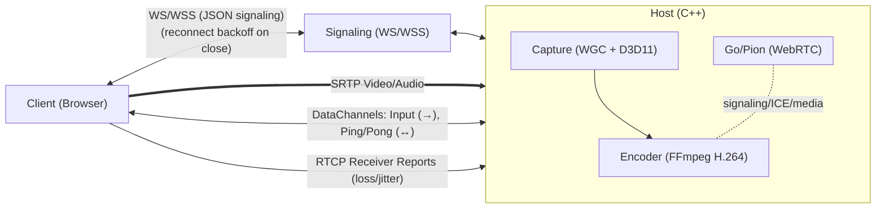
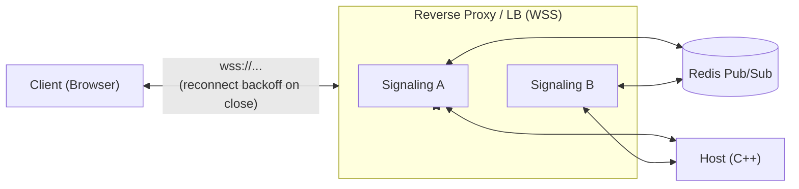

# P2P Cloud Gaming & Remote Desktop

This project is a high-performance, peer-to-peer (P2P) solution for cloud gaming and remote desktop streaming. It allows a user to stream gameplay or a desktop session from a powerful "Host" machine to a lightweight "Client" machine with low latency, using a custom-built architecture that leverages WebRTC for direct P2P communication.

## Architecture Overview

The system is composed of three main components that work together to establish a streaming session:



Optional scalable signaling topology:



1.  **Host (C++)**: A native Windows application that captures the screen (Windows Graphics Capture), audio (WASAPI), and encodes them into a video stream. It also receives and simulates keyboard/mouse input from the client.
2.  **Signaling Server (Node.js)**: A lightweight matchmaker for WebRTC offer/answer and ICE exchange. Supports single-node or scalable, stateless mode via `ScalableSignalingServer.js` with Redis Pub/Sub. It never carries media; only signaling JSON over WS/WSS.
3.  **Client (HTML/JS)**: A web-based application that connects to the Host, receives the video/audio stream, and sends user input back.

---

## Core Technologies

| Module | Language(s) | Key Libraries & Frameworks | Purpose |
| :--- | :--- | :--- | :--- |
| **Host** | C++ | **FFmpeg** (H.264), **Pion WebRTC** (Go), **WinRT/C++ (WGC)**, **Direct3D 11** | Screen/audio capture, H.264 encoding, WebRTC session management. |
| **Server** | JavaScript | **Node.js**, **ws** (WebSocket library), **Redis** | Signaling, matchmaking, and ICE candidate exchange. |
| **Client** | JavaScript | **HTML5**, WebRTC API | Renders video, captures user input, and manages the WebRTC connection. |

---

## Module Breakdown

### 1. Host (`/Host`)

The Host is the core of the streaming solution. It runs on the machine with the game or application to be streamed.

**Key Components:**
*   **`main.cpp`**: Entry point. Initializes D3D11, WGC capture, audio, encoder, and signaling. Loads `config.json`.
*   **Capture (`CaptureHelpers.cpp`)**: Uses **Windows Graphics Capture (WGC)** with a free-threaded frame pool. Frames are copied into a fixed **texture pool** (ID3D11Texture2D) to avoid per-frame allocations.
*   **Encoding (`Encoder.cpp`)**: Encodes frames with FFmpeg H.264 using the best available hardware (NVENC/QSV/AMF) and **GPU VideoProcessor** for BGRA→NV12. Caches **ID3D11VideoProcessorInput/OutputView** objects to avoid per-frame D3D allocations. Adaptive bitrate control is handled here.
*   **Audio (`AudioCapturer.cpp`)**: Uses **WASAPI** **event-driven** capture (with fallback) and **IAudioClock** for precise timestamps. Reuses persistent float buffers to minimize heap churn. Opus encoding and send to WebRTC.
*   **WebRTC (`gortc_main/main.go`)**: Pion-based module (Go, C-shared) for PeerConnection, data channels, and ICE. Provides RTT via video ping/pong and intercepts RTCP Receiver Reports.
*   **Input Handling (`KeyInputHandler`, `MouseInputHandler`)**: Receives events via data channels and simulates locally using `SendInput`.
*   **Signaling (`Websocket.cpp`)**: Connects to the Node server; validates inbound input messages, enforces rate limits, and sends/receives SDP/ICE.

### 2. Signaling Server (`/Server`)

This is a lightweight but essential component for establishing the P2P connection. The server is designed to be stateless, allowing multiple instances to run behind a load balancer for high availability and scalability.

**Key Components:**
*   **`PureSignalingServer.js`**: A simple implementation that allows two peers (one Host, one Client) to find each other and exchange the necessary information to connect.
*   **`ScalableSignalingServer.js`**: A more advanced, stateless implementation that uses **Redis** to store all room and session state. It uses a single, pattern-based Redis subscription (`psubscribe`) to efficiently handle messaging for all rooms, eliminating the need for per-client subscriptions and allowing for seamless scaling.
*   **`SecureSignalingServer.js`**: A room-based signaling server that provides more robust session management.
*   **Logic**: The server listens for WebSocket connections. When a client connects, it is added to a room. When it sends a message, the message is forwarded to the other peer in the room.

### 3. Client (`/Client`)

The Client is a simple web page that allows a user to connect to a Host and start streaming.

**Key Components:**
*   **`index.html`**: The main HTML structure, including a video element to render the stream.
*   **`PeerClient.js`**: Contains all the client-side logic for:
    *   Connecting to the Signaling Server.
    *   Creating a `RTCPeerConnection`.
    *   Creating an "offer" to send to the Host.
    *   Processing the "answer" from the Host.
    *   Handling ICE candidates to find the best P2P path.
    *   Receiving the remote video track and attaching it to the `<video>` element.
    *   Capturing keyboard/mouse events and sending them over a `RTCDataChannel`.

---

## How It Works: The Connection Flow

1.  The **Host** application is started. It connects to the **Signaling Server** via WebSocket and waits in a "room".
2.  The user opens the **Client** web page and enters the same room ID. The Client also connects to the Signaling Server.
3.  The Signaling Server now knows about both peers in the room and can relay messages between them.
4.  The **Client** creates a WebRTC "offer" (a description of its desired media session) and sends it to the server.
5.  The **Server** forwards this offer to the **Host**.
6.  The **Host** receives the offer, creates an "answer," and sends it back to the **Client** via the server.
7.  Simultaneously, both Client and Host are gathering **ICE candidates** (potential IP addresses and ports) and exchanging them through the server.
8.  Once they have exchanged the offer/answer and enough ICE candidates, a direct **P2P connection** is established between the Client and Host.
9.  The **Host** begins capturing (WGC), encoding (H.264), and streaming video frames directly to the **Client**.
10. The **Client** begins receiving the video stream and sending user input back to the Host. The Signaling Server is no longer needed for this session.

## Peer Disconnection Handling

The system now properly handles peer disconnection. When a client closes their browser or the connection is otherwise interrupted, the following occurs:

1.  The **Signaling Server** detects the closed WebSocket connection.
2.  It sends a `peer-disconnected` message to the other peer in the room (the **Host**).
3.  The **Host** receives this message and initiates a graceful shutdown, closing the PeerConnection, stopping the capture and encoding threads, and releasing all resources.
4.  On the **Client** side, if the connection is lost, it will display a "Connection Lost" message and attempt to reconnect. If the host disconnects, the client will be notified and will not attempt to reconnect.

---

## Adaptive Streaming & Bitrate Control

To provide a smooth experience even under changing network conditions, the Host implements a dynamic bitrate system that adapts the video quality in real-time. This prevents stream stuttering and freezing on weaker or unstable networks.

### Technical Implementation: The Feedback Loop

The system works by creating a continuous feedback loop between the Client and the Host.

1.  **Client Sends Feedback (RTCP):**
    *   The user's web browser, while receiving the video, automatically sends **RTCP (RTP Control Protocol) Receiver Reports** back to the Host. This is a standard part of the WebRTC protocol.
    *   These reports contain crucial statistics, most importantly **Packet Loss** (the percentage of video packets that never arrived) and **Jitter** (the variation in packet arrival times).

2.  **Go/Pion Intercepts the Feedback:**
    *   In `gortc_main/main.go`, an **RTCP Interceptor** (`rtcpReaderInterceptor`) is registered with the Pion WebRTC stack.
    *   This interceptor's job is to "catch" these incoming RTCP reports, open them, and extract the packet loss and jitter values.

3.  **Go Calls the C++ Callback:**
    *   The Go interceptor then calls a C function pointer that was registered by the C++ application.
    *   This call crosses the language boundary from Go to C++, passing the network statistics as arguments.

4.  **Encoder-managed AIMD controller:**
    *   RTCP stats (loss/jitter) are forwarded into `Encoder::OnRtcpFeedback`. RTT is computed from video datachannel ping/pong and combined in the callback.
    *   An **AIMD** (Additive Increase / Multiplicative Decrease) controller adjusts bitrate within configured min/max bounds.
    *   If runtime bitrate changes aren’t supported by the current codec, the encoder schedules a safe reopen between frames.

This entire process runs continuously, allowing the stream to adapt to changing network conditions in near real-time, ensuring the best possible quality and smoothness.

---

## Building and Running

This is a complex project with multiple components.

### Prerequisites
- Windows 10/11
- Visual Studio 2022 with C++ development workload
- Node.js and npm
- Go toolchain
- FFmpeg shared libraries (place `avcodec.dll`, `avformat.dll`, `avutil.dll`, `swresample.dll`, `swscale.dll` in the same directory as the Host executable).

### 1. Build the Go WebRTC Module
```bash
cd gortc_main
go build -o pion_webrtc.dll -buildmode=c-shared main.go
# Copy the generated pion_webrtc.dll and pion_webrtc.h to the Host directory
```

### 2. Build the C++ Host
- Open `DisplayCaptureProject.sln` in Visual Studio.
- Ensure the project is configured to link against the FFmpeg libraries and the generated `pion_webrtc.lib`.
- Build the solution for the `x64` platform.

### 3. Run the Signaling Server
```bash
cd Server
npm install
# Run your desired server
node PureSignalingServer.js
```

### 4. Configure and Run the Host
- Edit `config.json` to specify the target application to capture.
- Run the compiled `DisplayCaptureProject.exe`. Note the Room ID it prints to the console.

### Configuration (`config.json`)

```json
{
  "client": { "serverUrlBase": "ws://localhost:3002" },
  "host": {
    "targetProcessName": "chrome.exe",
    "window": { "resizeClientArea": true, "targetWidth": 1920, "targetHeight": 1080 },
    "video": { "fps": 120, "bitrateStart": 20000000, "bitrateMin": 10000000, "bitrateMax": 50000000 },
    "capture": {
      "maxQueueDepth": 4,
      "dropWindowMs": 200,
      "dropMinEvents": 2,
      "mmcss": { "enable": true, "priority": 2 }
    }
  }
}
```

Key fields:
- `video`: encoder FPS and bitrate bounds; the AIMD controller operates within `bitrateMin..bitrateMax`.
- `capture.maxQueueDepth`: bounded frame queue to keep latency low; older frames are dropped first.
- `capture.dropWindowMs`/`dropMinEvents`: if the encoder backlogs (EAGAIN) at least `dropMinEvents` times in `dropWindowMs`, the next capture frame is dropped (latency > throughput).
- `capture.mmcss`: enables Multimedia Class Scheduler (MCSS) “Games” profile for the capture/encode thread with a configurable priority.

### Design & Efficiency Highlights

- **Windows Graphics Capture (WGC) + D3D11**
  - WGC free-threaded frame pool for low-latency capture.
  - Copy to a fixed **texture pool** (no per-frame `CreateTexture2D`).
  - **View caching**: reuse D3D11 VideoProcessor input/output views per pooled texture and per FFmpeg NV12 frame.

- **Backpressure-aware frame dropping**
  - If FFmpeg encoder returns `EAGAIN` too often in recent window → drop incoming capture frames to avoid multi-frame latency spikes.

- **Audio low-latency path**
  - WASAPI **event-driven** capture (fallback to polling).
  - **IAudioClock**-based timestamps to minimize A/V drift.
  - Persistent float buffers to avoid per-packet allocations.

- **Bitrate adaptation inside the encoder**
  - AIMD controller uses RTCP loss/jitter plus RTT from datachannel.
  - If a codec can’t change bitrate live, the encoder does a safe reopen between frames.

- **Input validation & rate limiting**
  - Host validates key codes against an allowlist, clamps mouse ranges, drops oversized messages, and rate-limits key/mouse events.

- **Prod-ready toggles**
  - Configurable MMCSS, drop policy, and queue depth via `config.json`.
  - When exposed to the Internet: enable WSS via reverse proxy and require a room token at the signaling layer.

### 5. Run the Client
- Open `Client/html-server/index.html` in a web browser.
- Enter the Room ID from the Host and click "Connect".
