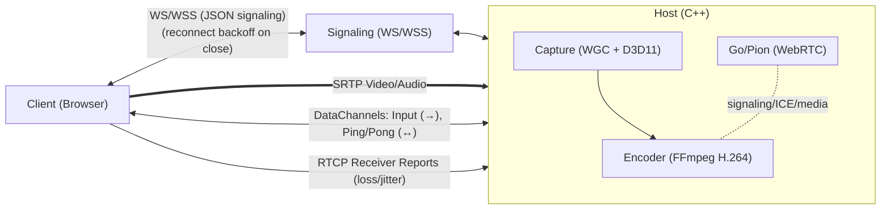
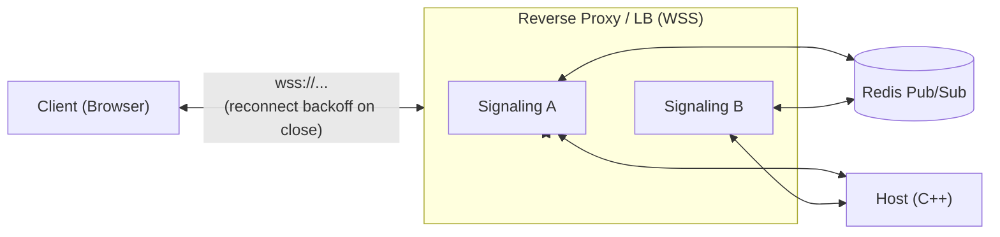

# P2P Cloud Gaming & Remote Desktop

This project is a high-performance, peer-to-peer (P2P) solution for cloud gaming and remote desktop streaming. It allows a user to stream gameplay or a desktop session from a powerful "Host" machine to a lightweight "Client" machine with low latency, using a custom-built architecture that leverages WebRTC for direct P2P communication.

## Architecture Overview

The system is composed of three main components that work together to establish a streaming session:



Optional scalable signaling topology:



1.  **Host (C++)**: A native Windows application that captures the screen (Windows Graphics Capture), audio (WASAPI), and encodes them into a video stream. It also receives and simulates keyboard/mouse input from the client.
2.  **Signaling Server (Node.js)**: A production-ready, scalable signaling server (`ScalableSignalingServer.js`) with Redis Pub/Sub, comprehensive security, observability, and resilience features. Supports single-node or horizontal scaling with stateless design.
3.  **Client (HTML/JS)**: A web-based application that connects to the Host, receives the video/audio stream, and sends user input back.

---

## Core Technologies

| Module | Language(s) | Key Libraries & Frameworks | Purpose |
| :--- | :--- | :--- | :--- |
| **Host** | C++ | **FFmpeg** (H.264), **Pion WebRTC** (Go), **WinRT/C++ (WGC)**, **Direct3D 11** | Screen/audio capture, H.264 encoding, WebRTC session management. |
| **Server** | JavaScript | **Node.js**, **ws** (WebSocket), **Redis**, **pino** (logging), **zod** (validation), **prom-client** (metrics) | Production signaling with security, observability, and scalability. |
| **Client** | JavaScript | **HTML5**, WebRTC API | Renders video, captures user input, and manages the WebRTC connection. |

---

## Module Breakdown

### 1. Host (`/Host`)

The Host is the core of the streaming solution. It runs on the machine with the game or application to be streamed.

**Key Components:**
*   **`main.cpp`**: Entry point. Initializes D3D11, WGC capture, audio, encoder, and signaling. Loads `config.json`.
*   **Capture (`CaptureHelpers.cpp`)**: Uses **Windows Graphics Capture (WGC)** with a free-threaded frame pool. Frames are copied into a fixed **texture pool** (ID3D11Texture2D) to avoid per-frame allocations.
*   **Encoding (`Encoder.cpp`)**: Encodes frames with FFmpeg H.264 using the best available hardware (NVENC/QSV/AMF) and **GPU VideoProcessor** for BGRA→NV12. Caches **ID3D11VideoProcessorInput/OutputView** objects to avoid per-frame D3D allocations. Adaptive bitrate control is handled here.
*   **Audio (`AudioCapturer.cpp`)**: Uses **WASAPI** **event-driven** capture (with fallback) and **IAudioClock** for precise timestamps. Reuses persistent float buffers to minimize heap churn. Opus encoding and send to WebRTC.
*   **WebRTC (`gortc_main/main.go`)**: Pion-based module (Go, C-shared) for PeerConnection, data channels, and ICE. Provides RTT via video ping/pong and intercepts RTCP Receiver Reports.
*   **Input Handling (`KeyInputHandler`, `MouseInputHandler`)**: Receives events via data channels and simulates locally using `SendInput`.
*   **Signaling (`Websocket.cpp`)**: Connects to the Node server; validates inbound input messages, enforces rate limits, and sends/receives SDP/ICE.

### 2. Signaling Server (`/Server`)

A production-ready, horizontally-scalable signaling server with comprehensive security, observability, and resilience features.

**Key Components:**
*   **`ScalableSignalingServer.js`**: The main production server with Redis Pub/Sub, comprehensive security, and observability.
*   **`config.js`**: Environment-driven configuration with schema validation using `zod`.
*   **`logger.js`**: Structured JSON logging with `pino`, including redaction and contextual fields.
*   **`health.js`**: Lightweight HTTP server exposing `/healthz`, `/readyz`, and `/metrics` endpoints.
*   **`validation.js`**: Message schema validation using `zod` for offer/answer/candidate/control messages.
*   **`rateLimiter.js`**: Redis-backed token bucket rate limiting for connections and messages.
*   **`redisScripts.js`**: Lua scripts for atomic room join/leave operations.
*   **`metrics.js`**: Prometheus metrics for observability (connections, messages, latency, errors).

**Production Features:**
*   **Security**: WSS enforcement, Origin validation, JWT authentication, room authorization
*   **Resilience**: Graceful shutdown, Redis circuit breaker, atomic operations, backpressure handling
*   **Observability**: Structured logging, Prometheus metrics, health checks, distributed tracing
*   **Scalability**: Stateless design, Redis Pub/Sub, horizontal scaling support
*   **Rate Limiting**: Per-connection, per-IP, and per-room message throttling
*   **Input Validation**: Schema-based message validation with error metrics

**Legacy Components:**
*   **`PureSignalingServer.js`**: Simple implementation for development/testing.
*   **`SecureSignalingServer.js`**: Room-based signaling with basic session management.

### 3. Client (`/Client`)

The Client is a simple web page that allows a user to connect to a Host and start streaming.

**Key Components:**
*   **`index.html`**: The main HTML structure, including a video element to render the stream.
*   **`PeerClient.js`**: Contains all the client-side logic for:
    *   Connecting to the Signaling Server.
    *   Creating a `RTCPeerConnection`.
    *   Creating an "offer" to send to the Host.
    *   Processing the "answer" from the Host.
    *   Handling ICE candidates to find the best P2P path.
    *   Receiving the remote video track and attaching it to the `<video>` element.
    *   Capturing keyboard/mouse events and sending them over a `RTCDataChannel`.

---

## How It Works: The Connection Flow

1.  The **Host** application is started. It connects to the **Signaling Server** via WebSocket and waits in a "room".
2.  The user opens the **Client** web page and enters the same room ID. The Client also connects to the Signaling Server.
3.  The Signaling Server now knows about both peers in the room and can relay messages between them.
4.  The **Client** creates a WebRTC "offer" (a description of its desired media session) and sends it to the server.
5.  The **Server** forwards this offer to the **Host**.
6.  The **Host** receives the offer, creates an "answer," and sends it back to the **Client** via the server.
7.  Simultaneously, both Client and Host are gathering **ICE candidates** (potential IP addresses and ports) and exchanging them through the server.
8.  Once they have exchanged the offer/answer and enough ICE candidates, a direct **P2P connection** is established between the Client and Host.
9.  The **Host** begins capturing (WGC), encoding (H.264), and streaming video frames directly to the **Client**.
10. The **Client** begins receiving the video stream and sending user input back to the Host. The Signaling Server is no longer needed for this session.

## Peer Disconnection Handling

The system now properly handles peer disconnection. When a client closes their browser or the connection is otherwise interrupted, the following occurs:

1.  The **Signaling Server** detects the closed WebSocket connection.
2.  It sends a `peer-disconnected` message to the other peer in the room (the **Host**).
3.  The **Host** receives this message and initiates a graceful shutdown, closing the PeerConnection, stopping the capture and encoding threads, and releasing all resources.
4.  On the **Client** side, if the connection is lost, it will display a "Connection Lost" message and attempt to reconnect. If the host disconnects, the client will be notified and will not attempt to reconnect.

---

## Adaptive Streaming & Bitrate Control

To provide a smooth experience even under changing network conditions, the Host implements a dynamic bitrate system that adapts the video quality in real-time. This prevents stream stuttering and freezing on weaker or unstable networks.

### Technical Implementation: The Feedback Loop

The system works by creating a continuous feedback loop between the Client and the Host.

1.  **Client Sends Feedback (RTCP):**
    *   The user's web browser, while receiving the video, automatically sends **RTCP (RTP Control Protocol) Receiver Reports** back to the Host. This is a standard part of the WebRTC protocol.
    *   These reports contain crucial statistics, most importantly **Packet Loss** (the percentage of video packets that never arrived) and **Jitter** (the variation in packet arrival times).

2.  **Go/Pion Intercepts the Feedback:**
    *   In `gortc_main/main.go`, an **RTCP Interceptor** (`rtcpReaderInterceptor`) is registered with the Pion WebRTC stack.
    *   This interceptor's job is to "catch" these incoming RTCP reports, open them, and extract the packet loss and jitter values.

3.  **Go Calls the C++ Callback:**
    *   The Go interceptor then calls a C function pointer that was registered by the C++ application.
    *   This call crosses the language boundary from Go to C++, passing the network statistics as arguments.

4.  **Encoder-managed AIMD controller:**
    *   RTCP stats (loss/jitter) are forwarded into `Encoder::OnRtcpFeedback`. RTT is computed from video datachannel ping/pong and combined in the callback.
    *   An **AIMD** (Additive Increase / Multiplicative Decrease) controller adjusts bitrate within configured min/max bounds.
    *   If runtime bitrate changes aren't supported by the current codec, the encoder schedules a safe reopen between frames.

This entire process runs continuously, allowing the stream to adapt to changing network conditions in near real-time, ensuring the best possible quality and smoothness.

---

## Building and Running

This is a complex project with multiple components.

### Prerequisites
- Windows 10/11
- Visual Studio 2022 with C++ development workload
- Node.js and npm
- Go toolchain
- Redis (for production signaling server)
- FFmpeg shared libraries (place `avcodec.dll`, `avformat.dll`, `avutil.dll`, `swresample.dll`, `swscale.dll` in the same directory as the Host executable).

### 1. Build the Go WebRTC Module
```bash
cd gortc_main
go build -o pion_webrtc.dll -buildmode=c-shared main.go
# Copy the generated pion_webrtc.dll and pion_webrtc.h to the Host directory
```

### 2. Build the C++ Host
- Open `DisplayCaptureProject.sln` in Visual Studio.
- Ensure the project is configured to link against the FFmpeg libraries and the generated `pion_webrtc.lib`.
- Build the solution for the `x64` platform.

### 3. Run the Signaling Server

#### Development (Simple Server)
```bash
cd Server
npm install
node PureSignalingServer.js
```

#### Production (Scalable Server)
```bash
cd Server
npm install

# Start Redis (required for production server)
# Option 1: Docker
docker run -p 6379:6379 redis:7-alpine

# Option 2: Local installation
# Install Redis on your system

# Create environment configuration
cp ENV_README.md .env
# Edit .env with your settings

# Run the production server
npm start
```

**Environment Configuration:**
Create a `.env` file in the `Server` directory with the following settings:

```env
# Server Configuration
NODE_ENV=development
WS_PORT=3002
HEALTH_PORT=8080

# Redis Configuration
REDIS_URL=redis://127.0.0.1:6379

# Room Configuration
ROOM_CAPACITY=2
ROOM_TTL_SECONDS=120

# Message Limits
MESSAGE_MAX_BYTES=262144
BACKPRESSURE_CLOSE_THRESHOLD_BYTES=5242880

# Rate Limiting
RATE_LIMIT_MESSAGES_PER_10S=200
RATE_LIMIT_IP_MSGS_PER_10S=500
RATE_LIMIT_ROOM_MSGS_PER_10S=1000
RATE_LIMIT_CONN_PER_10S=50

# Security (Production)
REQUIRE_WSS=false
ALLOWED_ORIGINS=
SUBPROTOCOL=
ENABLE_AUTH=false
JWT_SECRET=
JWT_ISSUER=
JWT_AUDIENCE=

# Logging
PRETTY_LOGS=true
```

### 4. Configure and Run the Host
- Edit `config.json` to specify the target application to capture.
- Run the compiled `DisplayCaptureProject.exe`. Note the Room ID it prints to the console.

### Configuration (`config.json`)

```json
{
  "client": { "serverUrlBase": "ws://localhost:3002" },
  "host": {
    "targetProcessName": "chrome.exe",
    "window": { "resizeClientArea": true, "targetWidth": 1920, "targetHeight": 1080 },
    "video": {
      "fps": 120,
      "bitrateStart": 20000000,
      "bitrateMin": 10000000,
      "bitrateMax": 50000000,
      "gpuTiming": false,
      "deferredContext": false,
      "exportMetrics": false
    },
    "capture": {
      "maxQueueDepth": 4,
      "framePoolBuffers": 6,
      "dropWindowMs": 200,
      "dropMinEvents": 2,
      "minUpdateInterval100ns": 0,
      "skipUnchanged": false,
      "mmcss": { "enable": true, "priority": 2 }
    }
  }
}
```

Key fields:
- `video.fps`: target encoder framerate.
- `video.bitrateStart/bitrateMin/bitrateMax`: AIMD bitrate control bounds and starting point.
- `video.gpuTiming` (default false): when true, measures D3D11 VideoProcessor GPU time per second and logs it; latest ms value exposed via metrics.
- `video.deferredContext` (default false): hint to prefer deferred paths. Note: D3D11 video processing executes via `ID3D11VideoContext` (immediate). The flag is a placeholder for future async/compute paths.
- `video.exportMetrics` (default false): when true, periodically emits a `video-metrics` JSON over the signaling WebSocket with queue depth, drop counters, and GPU ms.
- `capture.maxQueueDepth`: bounded capture queue size; oldest frames are dropped first to keep latency low.
- `capture.framePoolBuffers` (default 6): number of buffers in the WGC free-threaded frame pool to absorb transient latency.
- `capture.dropWindowMs`/`dropMinEvents`: drop policy threshold based on encoder backpressure (EAGAIN).
- `capture.minUpdateInterval100ns` (default 0): when 0, the host derives `10,000,000 / fps` (100ns units) to match the target FPS; set explicitly to override.
- `capture.skipUnchanged` (default false): enables a lightweight heuristic to skip enqueueing near-duplicate frames when inter-frame time deltas are extremely small.
- `capture.mmcss`: enables Multimedia Class Scheduler (MCSS) "Games" profile for the capture/encode thread with configurable priority.

### Video Metrics (when `video.exportMetrics` is true)
- Emitted once per second on the signaling WebSocket as a JSON message with `type: "video-metrics"`:
  - `queueDepth`: current depth of the capture→encode SPSC ring buffer.
  - `overwriteDrops`: total count of times the ring overwrote the oldest frame due to being full.
  - `backpressureSkips`: total frames skipped by the consumer when the encoder reported backpressure.
  - `outOfOrder`: total out-of-order consumptions observed (should remain 0).
  - `vpGpuMs`: last observed GPU time in milliseconds for D3D11 VideoProcessor (BGRA→NV12) when `video.gpuTiming` is enabled.

### ETW/PIX Instrumentation
- ETW markers:
  - `Capture_Enqueue_Start/End`: around capture enqueue into the SPSC ring.
  - `Encoder_Send_Start/End`: around handoff of encoded frame bytes to the sender queue.
- To enable real ETW events: define `ETW_TRACELOGGING` at build time and register the provider at process start; otherwise, markers are no-ops.
- PIX/ETW runbook (high level):
  - Capture a PIX GPU trace while streaming; correlate `vpGpuMs` logs with GPU Events to validate the VideoProcessor isn’t a bottleneck.
  - Use Windows Performance Analyzer (ETW) to correlate `Capture_Enqueue_*` and `Encoder_Send_*` markers with CPU scheduling and thread contention.
  - Look for spikes in `overwriteDrops`/`backpressureSkips` and correlate with encoder EAGAIN and network conditions.

### 5. Run the Client
- Open `Client/html-server/index.html` in a web browser.
- Enter the Room ID from the Host and click "Connect".

---

## Testing Strategy

The project includes a comprehensive testing strategy with multiple layers:

### Unit Tests
- **Validators**: Message schema validation using `zod`
- **Rate Limiter**: Token bucket algorithm and window management
- **Configuration**: Environment variable parsing and validation
- **Logger**: Structured logging output and redaction

### Integration Tests
- **Redis Operations**: Atomic join/leave, capacity enforcement, TTL behavior
- **Pub/Sub**: Message fanout across multiple server instances
- **Reconnection**: Redis outage recovery and resubscription
- **Circuit Breaker**: Failure detection and graceful degradation

### End-to-End Tests
- **Signaling Flow**: Complete offer/answer/candidate exchange
- **Room Management**: Join, message exchange, leave scenarios
- **Graceful Shutdown**: Server drain and client notification
- **Security**: JWT authentication and room authorization

### Chaos Tests
- **Redis Outage**: Mid-session Redis failure and recovery
- **Server Restart**: Forced shutdown and client reconnection
- **Network Issues**: Simulated packet loss and delays

### Running Tests
```bash
cd Server
npm test                    # Run all tests
npm run test:unit          # Unit tests only
npm run test:integration   # Integration tests only
npm run test:e2e          # End-to-end tests only
```

---

## Performance and Scale Validation

The signaling server is designed for high-performance, horizontally-scalable deployments:

### Load Testing
- **Tools**: k6 or Artillery for realistic signaling patterns
- **Scenarios**: Room creation bursts, sustained message traffic, rapid connect/disconnect cycles
- **Metrics**: Connection latency, message fanout latency, error rates, Redis command latency

### Capacity Planning
- **Instance Sizing**: CPU/memory footprints at target QPS
- **Redis Throughput**: Headroom for pub/sub and set operations
- **Horizontal Scaling**: Room distribution across instances
- **Saturation Points**: Performance degradation thresholds

### Performance Tuning
- **Message Size Limits**: Configurable `MESSAGE_MAX_BYTES`
- **Rate Limiting**: Per-connection, per-IP, and per-room throttling
- **Backpressure**: Configurable close thresholds for excessive buffering
- **Heartbeat**: Configurable ping/pong intervals for connection health

### Monitoring and Observability
- **Prometheus Metrics**: Active connections, message throughput, latency histograms
- **Health Checks**: `/healthz` (liveness) and `/readyz` (readiness)
- **Structured Logging**: JSON format with contextual fields and redaction
- **Distributed Tracing**: Instance and request correlation

---

## Production Deployment

### Security Considerations
- **Transport Security**: Enforce WSS (WebSocket Secure) in production
- **Authentication**: JWT-based authentication with short-lived tokens
- **Authorization**: Room-level access control via JWT claims
- **Input Validation**: Schema-based message validation
- **Rate Limiting**: Multi-level throttling to prevent abuse

### High Availability
- **Load Balancing**: Multiple signaling server instances behind a reverse proxy
- **Redis Cluster**: For high-throughput deployments
- **Health Checks**: Integration with load balancers and container orchestrators
- **Graceful Shutdown**: Proper connection draining and resource cleanup

### Monitoring and Alerting
- **Metrics Collection**: Prometheus scraping of `/metrics` endpoint
- **Log Aggregation**: Centralized logging with structured JSON
- **Alerting**: SLO-based alerts for error rates, latency, and availability
- **Dashboards**: Grafana or similar for visualization

### Design & Efficiency Highlights

- **Windows Graphics Capture (WGC) + D3D11**
  - WGC free-threaded frame pool for low-latency capture.
  - Copy to a fixed **texture pool** (no per-frame `CreateTexture2D`).
  - **View caching**: reuse D3D11 VideoProcessor input/output views per pooled texture and per FFmpeg NV12 frame.

- **Backpressure-aware frame dropping**
  - If FFmpeg encoder returns `EAGAIN` too often in recent window → drop incoming capture frames to avoid multi-frame latency spikes.

- **Audio low-latency path**
  - WASAPI **event-driven** capture (fallback to polling).
  - **IAudioClock**-based timestamps to minimize A/V drift.
  - Persistent float buffers to avoid per-packet allocations.

- **Bitrate adaptation inside the encoder**
  - AIMD controller uses RTCP loss/jitter plus RTT from datachannel.
  - If a codec can't change bitrate live, the encoder does a safe reopen between frames.

- **Input validation & rate limiting**
  - Host validates key codes against an allowlist, clamps mouse ranges, drops oversized messages, and rate-limits key/mouse events.

- **Prod-ready toggles**
  - Configurable MMCSS, drop policy, and queue depth via `config.json`.
  - When exposed to the Internet: enable WSS via reverse proxy and require a room token at the signaling layer.

- **Production Signaling Server**
  - Environment-driven configuration with schema validation
  - Structured logging with redaction and contextual fields
  - Comprehensive security features (WSS, JWT, rate limiting)
  - Observability with Prometheus metrics and health checks
  - Resilience with graceful shutdown and circuit breakers
  - Horizontal scalability with Redis Pub/Sub
