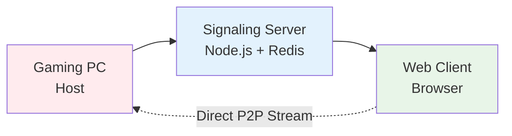
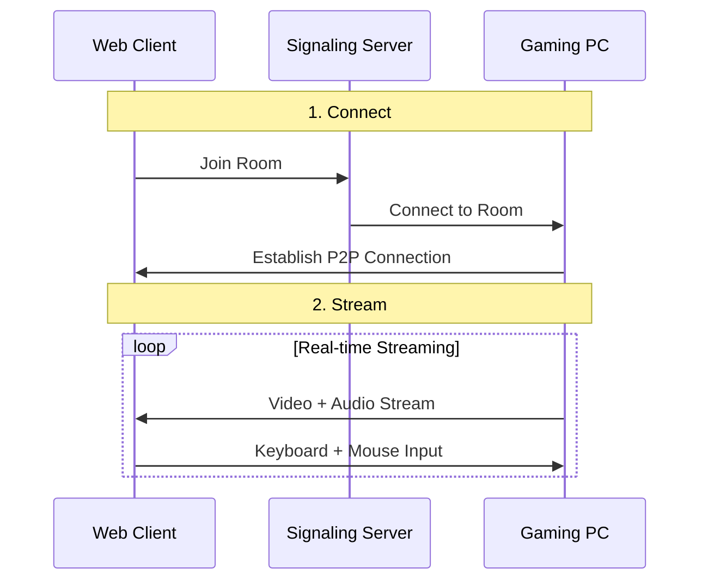
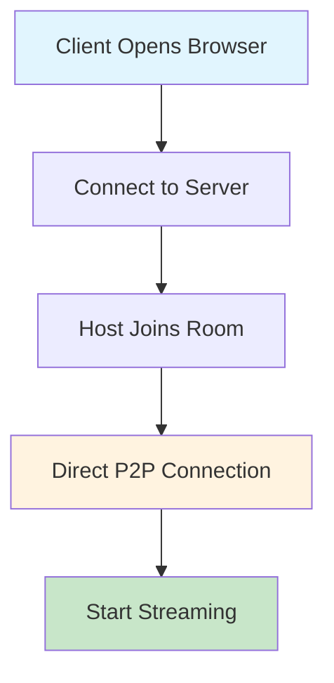
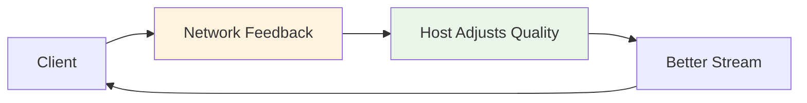
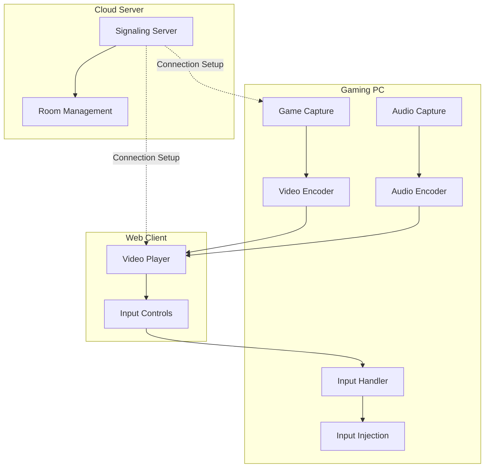
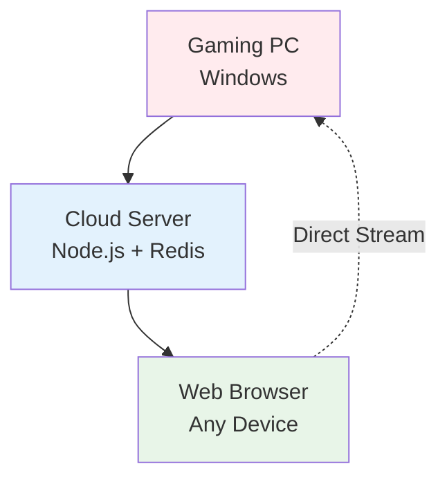

# DisplayCaptureProject - High-Level Architecture

## 1. System Overview

## 2. Data Flow

## 3. Connection Process

## 4. Quality Adaptation

## 5. Key Components

## 6. Deployment

## Key Features

### 🚀 **Performance**
- Ultra-low latency streaming (<40ms)
- High frame rate support (up to 144 FPS)
- Hardware-accelerated encoding
- Adaptive quality control

### 🎮 **Gaming Focus**
- Real-time input injection
- Direct game process targeting
- Professional audio capture
- Network resilience

### 🌐 **Scalability**
- Redis-based room management
- WebRTC P2P connections
- Cross-platform web clients
- Cloud-ready architecture
